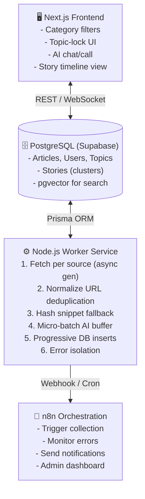

# 🗺️ Global News Aggregator


> **Multi-perspective news intelligence, synthesized by AI — built with streaming pipelines, open-source tools, and a learn-by-building philosophy.**

**Version**: 1.2 | **Last Updated**: April 2026  
**Status**: 🚧 Phase 0: Foundation Setup in progress

---

## 🎯 Project Goals

- **Aggregate** multi-perspective news: geopolitics (US, China, Russia, Europe, Middle East), Bangladesh-focused coverage, and global tech developments
- **Categorize & synthesize** articles using AI for entities, sentiment, bias indicators, and story clustering
- **Stream data continuously** with memory-safe micro-batch processing — no giant arrays, no memory spikes
- **Cluster related articles** into intelligent story threads with timeline views
- **Store structured data** in PostgreSQL with full metadata and semantic search capability
- **Provide a Next.js frontend** with category filters, topic-locking, AI chat/call interface, and story exploration
- **Display bias transparently** — informational perspective badges, not auto-correction
- **Send real-time notifications** for locked topics and story updates via Telegram/email
- **Learn backend engineering** through implementation: streaming pipelines, SQL, concurrency, testing

---

## 🏗️ System Architecture (Streaming-First)



🔑 **Key Principle**: _Stream early, dedup early, batch AI in micro-chunks, write progressively. No giant arrays. No memory spikes. Source failures don't block the pipeline._

---

## 🧰 Tech Stack

| Layer              | Technology                                            | Why                                                             |
| ------------------ | ----------------------------------------------------- | --------------------------------------------------------------- |
| **Database**       | PostgreSQL (via Supabase)                             | Relational fit, pgvector, free tier, learn SQL                  |
| **ORM**            | Prisma                                                | Type-safe, auto-migrations, TypeScript integration              |
| **Backend Worker** | Node.js + `node-cron` + `axios` + `p-limit`           | Streaming generators, concurrency control, testable             |
| **AI Processing**  | Qwen/OpenAI via API + prompt engineering              | Categorization, entity extraction, bias hints, story generation |
| **Frontend**       | Next.js 14 (App Router) + Tailwind                    | SSR, API routes, responsive UI                                  |
| **Orchestration**  | n8n (self-hosted or cloud)                            | Visual workflows for notifications, admin tasks                 |
| **Search**         | PostgreSQL full-text + `pgvector`                     | No external dependency for semantic matching                    |
| **Notifications**  | Telegram Bot API + Nodemailer                         | Free, reliable, mobile-friendly                                 |
| **Deployment**     | Vercel (Next.js) + Render/Railway (Worker) + Supabase | Free tiers, easy CI/CD                                          |

---

## ✨ Key Features

### 📰 Intelligent Ingestion

- Multi-source RSS/API fetching with async generators
- Streaming deduplication: normalized URL + content hash fallback
- Micro-batch AI enrichment (buffer size = 5) with `p-limit` concurrency

### 🧠 AI-Powered Synthesis

- Auto-categorization into geopolitics, Bangladesh, technology, etc.
- Entity extraction (countries, orgs, people)
- Sentiment scoring + transparent bias indicators
- Optional story clustering with timeline generation

### 🔍 Smart Discovery

- PostgreSQL full-text + semantic (`pgvector`) search
- Topic locking with real-time Telegram/email alerts
- Story thread exploration with chronological timeline view

### 🎨 User Experience

- Category/country filters with instant feedback
- "Perspective Indicator" badges showing source lens
- AI chat/call interface for conversational news queries
- Responsive design for mobile + desktop

### ⚙️ Developer Experience

- Phase-by-phase implementation with documented milestones
- Type-safe Prisma schema with auto-migrations
- Vitest integration tests for critical pipelines
- n8n admin dashboard for monitoring + workflow control

---

## 📁 Project Structure

```
global-news-aggregator/
├── docs/
│   ├── phase-0.md ... phase-5.md    # Phase documentation
│   └── ARCHITECTURE.md              # Detailed design decisions
├── frontend/                         # Next.js 16 App Router
│   ├── app/
│   │   ├── api/{articles,topics,stories}/route.ts
│   │   ├── page.tsx                  # Main news feed
│   │   └── stories/[slug]/page.tsx   # Story timeline view
│   ├── components/
│   │   ├── ArticleCard.tsx
│   │   ├── StoryCard.tsx
│   │   ├── TimelineView.tsx
│   │   └── AIChatInterface.tsx
│   └── lib/prisma.ts
├── worker/                           # Node.js streaming pipeline
│   ├── index.js                      # Orchestrator + p-limit
│   ├── sources/{rss,search,scraper}.js
│   ├── ai/{prompt,processor,clustering}.js
│   ├── db/{prisma,story}.js
│   └── utils/
│       ├── normalizeUrl.js           # Strip tracking params
│       ├── hashSnippet.js            # SHA-256 content dedup
│       ├── fingerprint.js            # Story clustering keys
│       └── logger.js
├── prisma/
│   ├── schema.prisma                 # Core data models
│   └── migrations/
├── n8n-workflows/
│   ├── notification-trigger.json
│   └── admin-monitor.json
├── .env.example
├── package.json
└── README.md
```

---

## 🚀 Quick Start (Phase 0)

**1. Clone & navigate**

```bash
git clone https://github.com/MainuddinMehedi/global-news-aggregator.git
cd global-news-aggregator
```

**2. Set up environment**

```bash
cp .env.example .env
```

> **Required Keys in `.env`:**
>
> - `DATABASE_URL`: Supabase connection string
> - `AI_API_KEY`: OpenAI or Qwen API key for synthesis
> - `TELEGRAM_BOT_TOKEN`: (Optional) for notifications

**3. Initialize database**

```bash
cd frontend
npm install
npx prisma migrate dev --name init
```

**4. Start development servers**

> 💡 **Upcoming Improvement**: A root-level setup using `concurrently` is planned so a single `npm run dev` starts everything. For now, open three terminals:

**Terminal 1: Next.js frontend**

```bash
cd frontend
npm run dev
```

**Terminal 2: Worker service**

```bash
cd ../worker
npm install
node index.js
```

**Terminal 3: n8n (optional for notifications)**

```bash
docker run -it --rm \
  --name n8n \
  -p 5678:5678 \
  -v ~/.n8n:/home/node/.n8n \
  n8nio/n8n
```

> 💡 **Tip**: Start with Phase 0 only. Commit each phase as a discrete, documented milestone. See `docs/phase-0.md` for detailed setup instructions.

---

## 🗓️ Implementation Roadmap

| Phase       | Focus                                                            | Estimated Time | Status         |
| ----------- | ---------------------------------------------------------------- | -------------- | -------------- |
| **Phase 0** | Foundation Setup: Repo, Supabase, Prisma, n8n, env               | Week 1         | 🔄 In Progress |
| **Phase 1** | Streaming Ingestion: RSS fetch, dedup, AI buffer, basic frontend | Week 2         | ⏳ Planned     |
| **Phase 2** | Topic Locking: Auth, full-text search, Telegram notifications    | Week 3         | ⏳ Planned     |
| **Phase 3** | Story Clustering: pgvector, entity matching, timeline UI         | Week 4         | ⏳ Planned     |
| **Phase 4** | Bias Transparency: Perspective badges, source diversity metrics  | Week 5         | ⏳ Planned     |
| **Phase 5** | Production Hardening: Monitoring, tests, admin dashboard         | Week 6         | ⏳ Planned     |

📄 Each phase includes:

- ✅ Completion checklist
- 📝 Documentation in `docs/phase-X.md`
- 🧪 Test cases for critical paths
- 💰 Cost/complexity notes

---

## 🤝 Contributing & Philosophy

This project follows core principles:

```
✅ Ship discrete, documented phases
✅ Prefer open-source, low-cost tools
✅ Learn backend by building, not just reading
✅ Bias detection = transparency, not correction
✅ Stream early, dedup early, write progressively
✅ Story clustering = optional intelligence layer, zero breaking changes
```

### License

- **Code**: MIT License — use, modify, and distribute freely
- **Content**: Respect source terms of use for all ingested news feeds
- **AI Outputs**: For personal/educational use; verify critical information

### Acknowledgments

- Built with ❤️ using Supabase, Prisma, Next.js, n8n, and Qwen/OpenAI
- Inspired by intelligence-style news synthesis and multi-perspective media literacy
