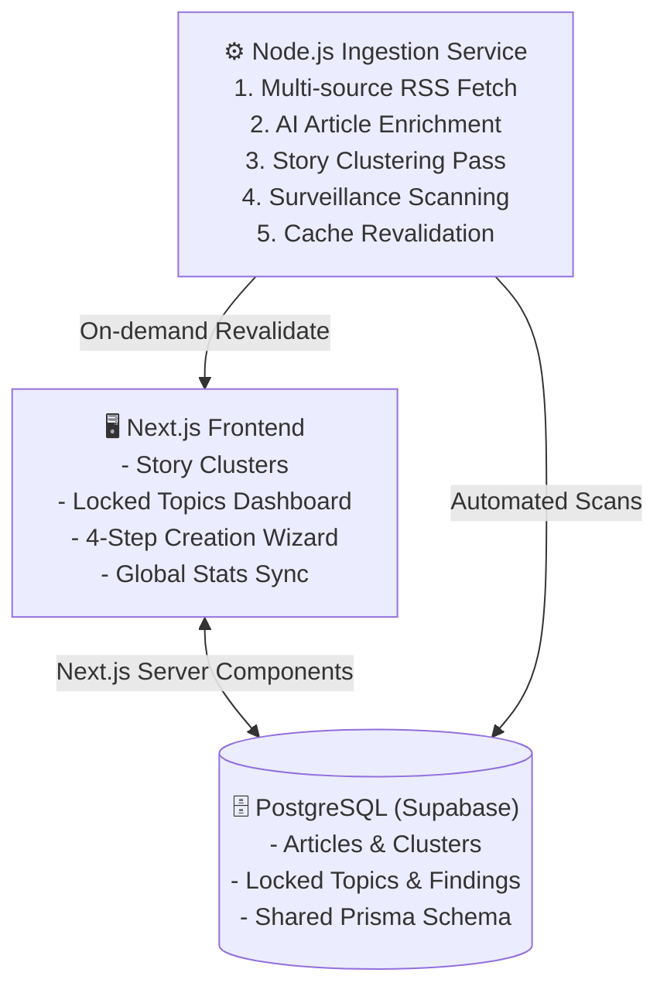

# 🗺️ Global News Aggregator


> **Multi-perspective news intelligence, synthesized by AI — your personal investigative researcher for global events.**

**Version**: 1.5 | **Status**: 🚧 Phase 2/3 (Surveillance & Investigation Complete)

---

## 🎯 Project Goals

- **Aggregate** multi-perspective news from diverse global sources (Western, Non-Western, and Local).
- **Categorize & Synthesize** articles with AI (Groq/Llama) to extract sentiment, bias, and story dossiers.
- **Persistent Surveillance**: Lock specific topics (geopolitics, career, niche interests) for 24/7 background monitoring.
- **AI-Refined Tracking**: Turn vague intents into structured surveillance queries using automated AI refinement.
- **Maintain Evolving Dossiers**: Dynamically cluster related articles into unified story threads with live impact scores.
- **Display Bias transparently**: Perspective badges for informational transparency, not automated correction.

---

## 🏗️ System Architecture


```mermaid
flowchart TD
    UI["🖥️ Next.js Frontend\n- Story Clusters\n- Locked Topics Dashboard\n- 4-Step Creation Wizard\n- Global Stats Sync"]
    DB[("🗄️ PostgreSQL (Supabase)\n- Articles & Clusters\n- Locked Topics & Findings\n- Shared Prisma Schema")]
    Worker["⚙️ Node.js Ingestion Service\n1. Multi-source RSS Fetch\n2. AI Article Enrichment\n3. Story Clustering Pass\n4. Surveillance Scanning\n5. Cache Revalidation"]

    UI <-->|"Next.js Server Components"| DB
    Worker -->|"Automated Scans"| DB
    Worker -->|"On-demand Revalidate"| UI
```

---

## ✨ Key Features

### 📰 Intelligent Ingestion
- Multi-source RSS/API fetching with async generators.
- Two-layer deduplication: normalized URL + SHA-256 content hash fallback.
- Sliding-window rate limiter tailored for strict TPM/RPM AI budgets.

### 🧠 AI-Powered Surveillance
- **Locked Topics**: Define an investigative interest and let AI refine the query for precision.
- **Automated Scanning**: New articles are automatically matched against your "locked" interests during ingestion.
- **Findings Dashboard**: Centralized view of all investigative matches with source-specific filtering.

### 🛡️ Story Dossiers
- Evolving clusters that automatically merge timelines, update impact scores, and track active lifecycles.
- **Why It Matters**: AI-generated context on the global significance of a story.

---

## 📁 Project Structure

```
global-news-aggregator/
├── frontend/                     # Next.js 16 App Router UI
│   ├── app/
│   │   ├── locked-topics/        # Investigative dashboard & trackers
│   │   └── stories/              # Story cluster timelines
│   ├── components/
│   │   ├── Feed/                 # Core article stream
│   │   └── locked-topics/        # 4-Step Creation Wizard & Grid
│   ├── store/                    # Zustand (Articles, Stories, Topics)
│   └── queries/                  # Cached Server Actions (Next.js 16)
├── ingestion-service/            # Node.js streaming pipeline
│   ├── db/prisma.js              # Shared DB client (Self-contained)
│   ├── ai/
│   │   ├── processor.js          # Ingestion + Surveillance logic
│   │   └── client.js             # AI Prompting & Refinement
│   └── index.js                  # Main orchestrator
└── prisma/
    └── schema.prisma             # Unified Data Model
```

---

## 🚀 Quick Start

**1. Set up environment**
```bash
cp .env.example .env
# Sync to frontend
cp .env frontend/.env.local
```
*Configure `DATABASE_URL` (Supabase) and `AI_PRIMARY_API_KEY` (Groq).*

**2. Initialize database**
```bash
npx prisma migrate dev
```

**3. Run the pipeline**
```bash
# In Root:
npm run ingest

# In Frontend:
cd frontend && npm run dev
```

---

## 🤝 Philosophy
- **Perspective Transparency**: Bias detection is for the user to interpret, not for the system to hide.
- **Investigation First**: The system acts as a persistent researcher, not just a passive reader.
- **Performance**: High-concurrency server-side caching with explicit revalidation.
