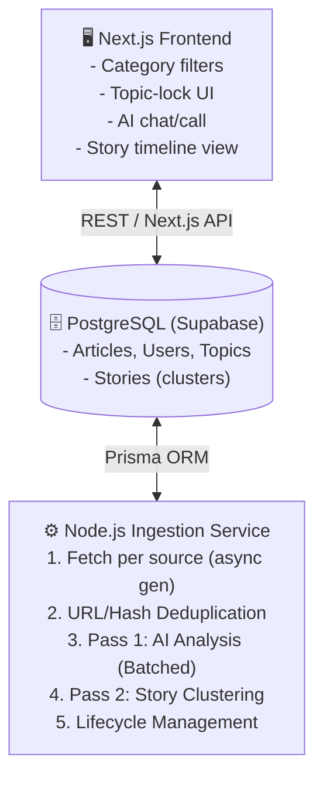

# 🗺️ Global News Aggregator


> **Multi-perspective news intelligence, synthesized by AI — built with streaming pipelines, open-source tools, and a learn-by-building philosophy.**

**Version**: 1.2 | **Status**: 🚧 Phase 1/3 (Core Ingestion & Clustering Complete)

---

## 🎯 Project Goals

- **Aggregate** multi-perspective news: geopolitics (US, China, Russia, Europe, Middle East), Bangladesh-focused coverage, and global tech developments.
- **Categorize & synthesize** articles using AI for entities, sentiment, bias indicators, and story clustering.
- **Maintain Evolving Dossiers** by dynamically clustering related articles into unified story threads that update their timelines and summaries as new events occur.
- **Stream data continuously** with memory-safe batch processing — respecting strict API rate limits without dropping data.
- **Store structured data** in PostgreSQL with full metadata.
- **Display bias transparently** — informational perspective badges, not auto-correction.
- **Send real-time notifications** for locked topics and story updates via Telegram/email (Upcoming).

---

## 🏗️ System Architecture


```mermaid
flowchart TD
    UI["🖥️ Next.js Frontend\n- Category filters\n- Topic-lock UI\n- AI chat/call\n- Story timeline view"]
    DB[("🗄️ PostgreSQL (Supabase)\n- Articles, Users, Topics\n- Stories (clusters)")]
    Worker["⚙️ Node.js Ingestion Service\n1. Fetch per source (async gen)\n2. URL/Hash Deduplication\n3. Pass 1: AI Analysis (Batched)\n4. Pass 2: Story Clustering\n5. Lifecycle Management"]

    UI <-->|"REST / Next.js API"| DB
    DB <-->|"Prisma ORM"| Worker
```

🔑 **Key Principles:**
1. **Two-Pass AI Architecture:** Fast micro-batches for individual article analysis (extraction/sentiment), followed by a decoupled, context-aware clustering pass to maintain story dossiers.
2. **Data Integrity via Code:** AI is used for synthesis, but deduplication, timeline merging, and relationship management are handled strictly by deterministic application code.
3. **Resilience:** Built-in fallback providers (Groq -> OpenRouter) and sliding-window rate limiters ensure pipeline stability during high volumes.

---

## 🧰 Tech Stack

| Layer              | Technology                                            | Why                                                             |
| ------------------ | ----------------------------------------------------- | --------------------------------------------------------------- |
| **Database**       | PostgreSQL (via Supabase)                             | Relational fit, free tier                                       |
| **ORM**            | Prisma                                                | Type-safe, auto-migrations, TypeScript integration              |
| **Ingestion**      | Node.js + ESM                                         | Streaming generators, custom rate-limiting                      |
| **AI Processing**  | Groq (Llama models) + OpenRouter fallback             | High-speed categorization, entity extraction, and clustering    |
| **Frontend**       | Next.js 15 (App Router) + Tailwind 4 + shadcn/ui      | SSR, Server Components, highly responsive UI                    |

---

## ✨ Key Features

### 📰 Intelligent Ingestion
- Multi-source RSS/API fetching with async generators.
- Two-layer deduplication: normalized URL + SHA-256 content hash fallback.
- Sliding-window rate limiter tailored for strict Tokens-Per-Minute (TPM) budgets.

### 🧠 AI-Powered Synthesis
- Auto-categorization (geopolitics, economy, technology, society, etc.).
- Entity extraction and strict JSON formatting.
- Sentiment scoring + transparent bias classification (Western, Eastern, Neutral).
- **Story Dossiers:** Evolving clusters that automatically merge new timelines, update impact scores, and track active lifecycles.

### 🔍 Smart Discovery
- PostgreSQL full-text search capability.
- Multi-perspective feed showing different source lenses on the same story.

---

## 📁 Project Structure

```
global-news-aggregator/
├── docs/                         # Project documentation and architectural decisions
├── frontend/                     # Next.js App Router UI
│   ├── app/
│   │   ├── api/                  # Backend endpoints
│   │   ├── chat/                 # AI Chat interface (Planned)
│   │   └── stories/              # Story timeline views
│   ├── components/               # React components (shadcn/ui)
│   └── queries/                  # Data access layer
├── ingestion-service/            # Node.js streaming pipeline
│   ├── index.js                  # Main ingestion orchestrator
│   ├── processBacklog.js         # Standalone backlog processing utility
│   ├── sources/                  # RSS and API fetchers
│   ├── ai/
│   │   ├── processor.js          # Two-pass AI logic and DB persistence
│   │   ├── client.js             # AI API client (Groq/OpenRouter)
│   │   ├── rateLimiter.js        # Sliding-window TPM/RPM tracker
│   │   └── tokenBatcher.js       # Tiktoken-based batch estimation
│   └── utils/                    # Hashing and URL normalization
├── prisma/
│   ├── schema.prisma             # Core data models
│   └── migrations/               # Database migration history
├── .env.example
├── package.json
└── README.md
```

---

## 🚀 Quick Start

**1. Clone & navigate**
```bash
git clone https://github.com/MainuddinMehedi/global-news-aggregator.git
cd global-news-aggregator
```

**2. Set up environment**
```bash
cp .env.example .env
```
*Configure your Supabase `DATABASE_URL` and Groq `AI_PRIMARY_API_KEY`.*

**3. Initialize database**
```bash
npx prisma migrate dev
```

**4. Start development**

*Run the ingestion pipeline:*
```bash
# Fetch new articles and process with AI
npm run ingest

# Or, run in raw-only mode (skip AI)
npm run ingest:raw

# Process any pending backlog
npm run backlog
```

*Run the frontend (in a separate terminal):*
```bash
cd frontend
npm install
npm run dev
```

---

## 🤝 Contributing & Philosophy

This project follows core principles:
- **Ship discrete, documented phases.**
- **Prefer open-source, low-cost tools.**
- **Bias detection = transparency, not correction.**
- **Maintain data integrity via code, not AI magic.**

### License
- **Code**: MIT License — use, modify, and distribute freely.
- **Content**: Respect source terms of use for all ingested news feeds.
- **AI Outputs**: For personal/educational use; verify critical information.
