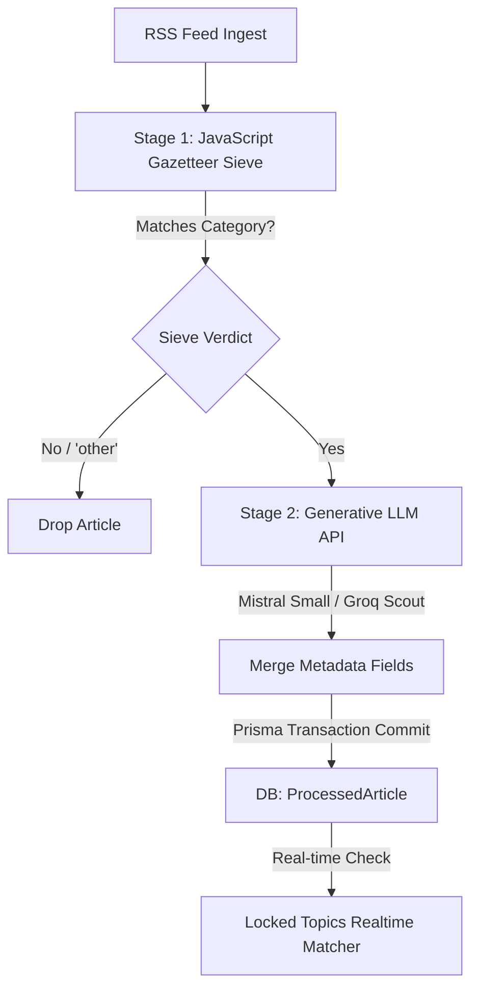

# Ingestion & Enrichment Pipeline

> **Feature Status:** Implemented (Evolution Planned)  
> **Feature ID:** `ENRICHMENT_PIPELINE`

---

## 📖 References Map
_(Items that require quick checkup, future plans, or jotting down)_

- **[AI Model Strategy Guide](AI_MODELS.md)** — _Definitive model assignments across the stack, detailing Mistral AI, Groq, and Google AI Studio usage for optimal speed, intelligence, and cost._

---

## 🎯 Current Direction
_(Always keep this section up-to-date. This outlines the current intentions and what we are actively trying to achieve with this feature. Before doing any tasks, we align with this intention.)_

The Enrichment Pipeline is currently stable. Our primary focus is monitoring API costs and rate limits under the new pg-boss queue system. 

👉 **[Immediate Action Board](action-board.md)**

---

## ⏳ Explicitly Deferred (v2 / Future Notes)
_(Items that are good ideas but not required right now. When the Immediate Action Board is empty, these items move up into the Current Direction.)_

- **Microservice Architecture Shift:** Executing NLP queries directly inside the main Node.js worker via serverless cloud endpoints to eliminate heavy dependencies.

---
---

## 📚 Technical Overview & Deep Dive
_(This section contains heavy schemas, architecture notes, and deep technical overviews. It is pushed to the bottom so it doesn't clutter the immediate action workflow. Update this occasionally when breaking changes or major architectural shifts occur.)_

### Table of Contents
- [[#1. Overview & Objective]]
- [[#2. Technical Architecture & Data Model]]
- [[#3. Implementation Notes & Reference Guide]]
- [[#4. Frontend Regional Resolution (Implemented)]]
- [[#5. Brainstorming & Feature Ideas]]

---

## 1. Overview & Objective

The **Enrichment Pipeline** is the core parsing engine of the Global News Aggregator. It processes raw RSS news articles, extracts structural metadata, and performs Natural Language Processing (NLP) to classify topics, map geographic footprints, and calculate sentiment.

By categorizing news across specific geopolitical axes, the pipeline allows users to understand the "Perspective Gap" (e.g., contrasting state-aligned reports with commercial feeds).

### Strategic Metadata Taxonomy

The system divides metadata into two groups to isolate **what happened** (event coordinates) from **who is telling the story** (publisher identity):

| Group                                                            | Field Name                                                        | Description                                                                                                                                                                                          | Source                                                  |
| :--------------------------------------------------------------- | :---------------------------------------------------------------- | :--------------------------------------------------------------------------------------------------------------------------------------------------------------------------------------------------- | :------------------------------------------------------ |
| **Group A: Publisher Identity** _(Who is talking?)_              | `sourceCountry`<br>`sourceType`<br>`biasGroup`<br>`coverageScope` | Home country of outlet (e.g., USA, Russia)<br>Publisher model (e.g., State Media, Commercial)<br>Ideological leaning (e.g., State-Aligned, Centrist)<br>Reporting footprint (e.g., Global, Regional) | Static (configured manually in `feeds.js` per RSS feed) |
| **Group B: Event Intelligence** _(What are they talking about?)_ | `eventRegion`<br>`categories`<br>`entities`<br>`sentimentScore`   | Geopolitical bloc where the event takes place<br>Topics (e.g., geopolitics, economy, business)<br>Extracted actors (PERSON, ORG, GPE, LOC)<br>Reporting tone polarity (-1.0 to +1.0)                 | Dynamic (generated for every article by the pipeline)   |

### Scope Boundaries

- **Micro-Batching:** Articles are buffered and processed in batches (default `AI_BATCH_SIZE=5`) to prevent rate limit exhaustion and optimize processing throughput.
- **Graceful Degradation:** If the primary AI provider rate limits or goes offline, the system falls back to the secondary provider (e.g., Mistral to Groq). If both fail, Stage 2 yields empty entities and null sentiment, allowing ingestion to continue without blocking.

---

## 2. Technical Architecture & Data Model

The pipeline utilizes a two-stage hybrid architecture:

- **Stage 1 (Node.js):** Fast, deterministic JavaScript keyword sieve. Categorizes articles and extracts regions using weights and exclusions from `gazetteer.json`. Non-matching articles are labeled `other` and dropped.
- **Stage 2 (LLM API):** Invokes generative LLM APIs (`mistral-small-2506` on Mistral as primary; `llama-4-scout-17b` on Groq as fallback) to extract entities, score sentiment, and analyze narrative bias.

### Data Model (Prisma Schema)

```prisma
model ProcessedArticle {
  id             String           @id @default(uuid())
  rawArticleId   String           @unique
  rawArticle     RawArticle       @relation(fields: [rawArticleId], references: [id], onDelete: Cascade)
  categories     Category[]       @relation("ProcessedArticleCategories")
  entities       String[]         // Extracted actors
  sentimentScore Float?           // VADER compound polarity (-1.0 to 1.0)
  biasNote       String?          // Inherited feed bias notes
  eventRegion    String?          // Geopolitical region of event (e.g. Middle East)
  model          String?
  processedAt    DateTime         @default(now())
}
```

### Process Flow



---

## 3. Implementation Notes & Reference Guide

### Key Code Artifacts

- [aiConfig.js](file:///home/mainu/programming/projects/automation/geopolitical-news-monitor/global-news-aggregator/ingestion-service/ai/aiConfig.js) — Centralized configuration for primary and fallback LLM client connections.
- [constants/categories.js](file:///home/mainu/programming/projects/automation/geopolitical-news-monitor/global-news-aggregator/ingestion-service/constants/categories.js) — Canonical list of allowed categorization topics.
- [enrichmentPipeline.js](file:///home/mainu/programming/projects/automation/geopolitical-news-monitor/global-news-aggregator/ingestion-service/newsPipeline/enrichmentPipeline.js) — Manages the dual-stage lifecycle, batching, and transactional DB commits.
- [stage1.js](file:///home/mainu/programming/projects/automation/geopolitical-news-monitor/global-news-aggregator/ingestion-service/newsPipeline/stage1.js) — Compiles and executes regular expressions from the Gazetteer.
- [gazetteer.json](file:///home/mainu/programming/projects/automation/geopolitical-news-monitor/global-news-aggregator/ingestion-service/data/gazetteer.json) — Config-driven dictionary defining weights and exclusions for category/region mapping.
- [stage2.js](file:///home/mainu/programming/projects/automation/geopolitical-news-monitor/global-news-aggregator/ingestion-service/newsPipeline/stage2.js) — Client connector invoking external LLM APIs (Mistral/Groq).
- [enrichment.js](file:///home/mainu/programming/projects/automation/geopolitical-news-monitor/global-news-aggregator/ingestion-service/newsPipeline/prompts/enrichment.js) — Modular system prompt and message template definition.
- [utils.ts](file:///home/mainu/programming/projects/automation/geopolitical-news-monitor/global-news-aggregator/frontend/lib/utils.ts) — Frontend utility mapping publisher country strings to macro geopolitical regions in-memory.

---


## 4. Frontend Regional Resolution (Implemented)

### The `sourceOrigin` Deletion Impact

The database column `sourceOrigin` was completely deleted from `RawArticle` to normalize the schema. The frontend successfully resolved this via in-memory derivation:

1. **Dynamic Regional Lookup (`frontend/lib/utils.ts`):**
   The `getPublisherRegion(country)` helper mirrors the static country-to-region mapping:
   ```typescript
   export const COUNTRY_TO_REGION: Record<string, string> = {
     "Bangladesh": "Asia-Pacific",
     "USA": "North America",
     "Qatar": "Middle East",
     // ...
   };
   ```
2. **PerspectiveWidget & Donut Charts (`frontend/queries/analytics.ts`):**
   Instead of using Prisma `groupBy` directly on the origin, the analytics query groups by `sourceCountry` and then maps to regions in-memory, aggregating the counts dynamically for the donut charts.
3. **Region Filtering Queries (`frontend/queries/articles.ts`):**
   When the user filters by region (e.g. `?origin=Asia-Pacific`), the query parses the `COUNTRY_TO_REGION` map backwards to extract the list of matching countries (e.g., `["Bangladesh", "India", "China"]`), and executes a Prisma `in` array comparison on the `sourceCountry` field:
   ```typescript
   const matchingCountries = Object.entries(COUNTRY_TO_REGION)
     .filter(([_, regionVal]) => regionVal.toLowerCase() === origin.toLowerCase())
     .map(([country]) => country);
   originFilter = [{ rawArticle: { sourceCountry: { in: matchingCountries } } }];
   ```

---

## 5. Brainstorming & Feature Ideas

- **Soft Power Cultural Widget:** A widget tracking the velocity of `PRODUCT` or `EVENT` entities across lifestyle and business feeds to measure the rise and fall of cultural soft power.
- **Real-Time Entity Anomaly Warnings:** Alert admins if a specific entity (e.g., a politician's name or a state agency) experiences a 500% spike in frequency across multiple regions, pointing to a developing crisis before a story cluster is fully formed.

## 🔗 Related Logs
_(Historical decisions, audits, and performance metrics that do not require quick checkups)_
