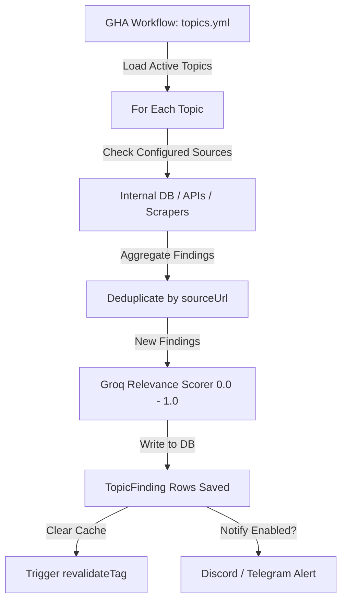

# Locked Topics

> **Feature Status:** Implemented  
> **Feature ID:** `LOCKED_TOPICS`

---

## References Map
_(Items that require quick checkup, future plans, or jotting down)_

- **[Locked Topics: V2 Architecture & Core Reasoning](locked-topics-v2-reasoning.md)** — *A synthesized architectural plan moving the system from a flat keyword scraper to an intelligence-augmented research agent with tiered filtering.*
- [pgvector-and-tsvector](../../pgvector-and-tsvector.md) - quick lookup into pgvector/tsvector and how they may fit the broader system.

---

## Current Direction

The current work is **not** a full v2 rebuild. The goal is to declutter the existing Locked Topics implementation, fix correctness and maintainability issues, and lay down a clean foundation that can support v2 later.

The split is:
- **Now:** stabilize the current implementation and improve quality without committing to heavy new architecture.
- **Soon, after cleanup:** decide whether the manual scan route needs a job queue immediately.
- **Later/v2:** vectors, feedback-driven learning, notifications, story clusters, adaptive source intelligence, and semantic deduplication.

👉 **[Immediate Action Board](action-board.md)**

---

## ⏳ Explicitly Deferred (v2 / Future Notes)
_(Items that are good ideas but not required right now. When the Immediate Action Board is empty, these items move up into the Current Direction.)_

- Global feedback system for articles and locked-topic findings.
- Notification preferences, digest mode, alert mode, and per-topic thresholds.
- pgvector/tsvector semantic relevance.
- Vector-based deduplication.
- Full simhash/entity-fingerprint dedup cascade.
- Story clusters and clustered presentation.
- Adaptive source health scoring and source discovery.
- Query refinement workflow with re-scoring of old findings.

---
---

## 📚 Technical Overview & Deep Dive
_(This section contains heavy schemas, architecture notes, and deep technical overviews. It is pushed to the bottom so it doesn't clutter the immediate action workflow. Update this occasionally when breaking changes or major architectural shifts occur.)_

### Table of Contents
- [1. Overview & Objective](#1-overview--objective)
  - [Why It Exists](#why-it-exists)
  - [Scope Boundaries](#scope-boundaries)
  - [Process Flow (Scanning Workflow)](#process-flow-scanning-workflow)
- [API Endpoints](#api-endpoints)
- [🔗 Related Logs](#-related-logs)

---

## 1. Overview & Objective

**Locked Topics** is a manual, intentional tracking system. Unlike Stories (which are dynamically auto-assembled by AI from the ingestion feed), Locked Topics are created explicitly by users for specific investigative or monitoring purposes. 

The system behaves like a dedicated researcher: it runs scans every 2 hours across all configured sources, parses the results, filters them for relevance using an AI model, and presents the findings in a structured feed.

### Why It Exists
- **Targeted Tracking:** Users need to follow highly specific narratives (e.g., "Google DeepMind Job Postings", "BD Government Procurement Changes", "Geopolitical border incidents") that might not form broad "Story Clusters" in the general news feed.
- **Persistent Memory:** Findings are kept indefinitely unless the topic itself is deleted or archived. They are never auto-purged by momentum decay.
	Thing to be noted. 

### Scope Boundaries
- **Single-User UI:** Database structure supports `userId`, but the current UI is single-tenant.

---
### Process Flow (Scanning Workflow)
Executed every 2 hours by `.github/workflows/topics.yml`:
1. **Load Active Topics:** Queries the database for `LockedTopic` rows where `isActive = true`.
2. **Execute Source Scanners:**
   - **Internal DB:** Queries `ProcessedArticle` using term matching (`aiRefinedQuery`).
   - **Google News RSS:** Hits `news.google.com/rss/search?q={query}`.
   - **Brave Search:** Calls the Brave Search API.
   - **Reddit:** Reads public search JSON feed.
   - **Web Scrapers / Webpage Diff:** Fetches target pages and checks for additions.
3. **Deduplication:** Filters out findings where `sourceUrl` already exists for this topic.
4. **AI Relevance Scoring:** Batches new finding titles into a Groq request. The LLM rates each on a `0.0` - `1.0` scale against the `aiRefinedQuery`.
5. **Save & Notify:** Writes new `TopicFinding` rows and triggers Discord/Telegram webhooks if score meets the threshold in `ALERT` mode.

---

## API Endpoints
- `POST /api/locked-topics` — Create topic.
- `POST /api/locked-topics/ai-refine` — Generate initial refined queries via Gemini Flash.
- `PATCH /api/locked-topics/[id]` — Edit metadata/toggles.
- `DELETE /api/locked-topics/[id]` — Cascade deletes topic and findings.
- `POST /api/locked-topics/[id]/scan` — Run immediate internal DB scan.
- `POST /api/locked-topics/[id]/summary` — Groq-generated narrative summary of findings.
- `GET /api/locked-topics/[id]/findings?cursor=id` — Infinite scroll endpoint.

---

## 🔗 Related Logs
_(Historical decisions, audits, and performance metrics that do not require quick checkups)_
