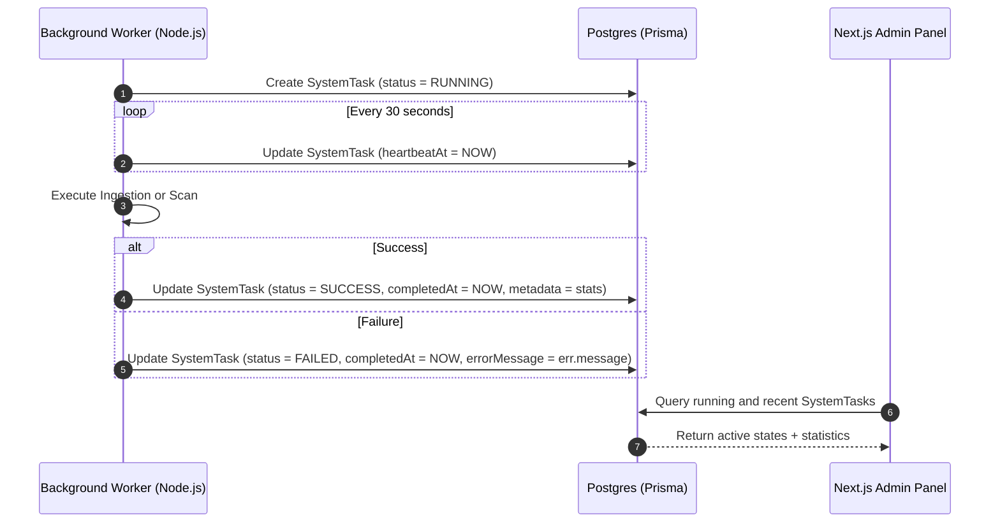
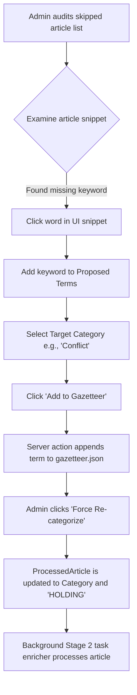

# Admin Dashboard Design & Specifications

> **Feature Status:** Planning & Design (In Progress)  
> **Feature ID:** `ADMIN_DASHBOARD`

---

## 📖 References Map

- **Prisma Schema:** [schema.prisma](file:///home/mainu/programming/projects/automation/geopolitical-news-monitor/global-news-aggregator/prisma/schema.prisma) — Database schema definition.
- **Auth RBAC:** [auth-rbac.md](file:///home/mainu/programming/projects/automation/geopolitical-news-monitor/global-news-aggregator/docs/1.%20Domain%20specific/auth-rbac.md) — Authentication and RBAC documentation.
- **Ingestion Script:** [runIngest.js](file:///home/mainu/programming/projects/automation/geopolitical-news-monitor/global-news-aggregator/ingestion-service/runIngest.js) — The raw article crawl orchestrator.
- **Active Feeds:** [feeds.js](file:///home/mainu/programming/projects/automation/geopolitical-news-monitor/global-news-aggregator/ingestion-service/data/feeds.js) — RSS feed sources config.
- **Analytics Queries:** [analytics.ts](file:///home/mainu/programming/projects/automation/geopolitical-news-monitor/global-news-aggregator/frontend/queries/analytics.ts) — Current analytics telemetry queries.

---

## 🎯 Current Direction
The objective is to plan, design, and implement a premium **Admin Dashboard** (`/system-supar-admin`) to provide full system observability, background task telemetry, RSS feed management (Source Control), AI configurations overrides, User management, and a Gazetteer sandbox to tune the Stage 1 categorization rules for skipped articles.

👉 **[Immediate Action Board](action-board.md)**

---

## ⏳ Explicitly Deferred (v2 / Future Notes)

- **Automated Source Health Diagnostics:** Build a weekly background cron that checks active sources, auto-flags feeds failing continuously for 7 days, and suggests alternative RSS urls.
- **Visual Run-History Gantt Chart:** Render a timeline visualizing when ingestion crawls and topic scans ran, highlighting execution durations, overlap, or resource starvation.
- **Zero-Deploy Config JSON Schema Validation:** Validate AI prompt overrides and setting schemas at the database layer before saving to prevent breaking background workers.
- **Third-party Webhook Alerting:** Discord/Telegram/Slack Webhook integration to push alerts when a background script encounters fatal errors.

---

## 📚 Technical Overview & Deep Dive

### Table of Contents
- [1. Objectives & Scope Boundaries](#1-objectives--scope-boundaries)
- [2. Proposed Database Schema Upgrades](#2-proposed-database-schema-upgrades)
- [3. Background Task Telemetry Architecture](#3-background-task-telemetry-architecture)
- [4. Frontend Tabs & View Layout Specs](#4-frontend-tabs--view-layout-specs)
- [5. API Layer & Server Actions Design](#5-api-layer--server-actions-design)
- [6. Gazetteer Sandbox Logic Flow](#6-gazetteer-sandbox-logic-flow)

---

### 1. Objectives & Scope Boundaries

- **Failsafe System Control:** Provide administrative toggles to instantly pause the ingestion pipeline or switch models to manage costs during traffic spikes or rate-limiting events.
- **Source CRUD & Health:** Move RSS feed definitions from static code config files to a PostgreSQL database table, allowing runtime mutations without redeployments.
- **Actionable Diagnostics:** Collect logs and heartbeats from background tasks (Cron / Github Actions) to visualize system operations and bottlenecks.
- **Granular Security:** Restrict `/system-supar-admin` and its server actions at the layout and middleware layers, allowing only accounts with the `ADMIN` role.

---

### 2. Proposed Database Schema Upgrades

To support dynamic administration, we will update [schema.prisma](file:///home/mainu/programming/projects/automation/geopolitical-news-monitor/global-news-aggregator/prisma/schema.prisma) with the following schema additions:

#### A. `FeedSource` Model (RSS Source Control)
Allows dynamic RSS feed management. Replaces the static `builtinFeeds` list.
```prisma
model FeedSource {
  id            String    @id @default(uuid())
  name          String    @unique
  url           String    @unique
  sourceCountry String
  sourceType    String    // e.g. "Commercial Publisher", "State Media"
  biasGroup     String    // e.g. "Centrist", "State-Aligned"
  coverageScope String    // e.g. "National", "Global"
  enabled       Boolean   @default(true)
  fetchFailures Int       @default(0)
  lastFetchedAt DateTime?
  createdAt     DateTime  @default(now())
  updatedAt     DateTime  @updatedAt
}
```

#### B. `SystemSetting` Model (Settings Overrides)
Stores global environment overrides (e.g. LLM overrides, pause flags, prompt parameters).
```prisma
model SystemSetting {
  key         String   @id
  value       Json     // Arbitrary configuration object
  description String?
  updatedAt   DateTime @updatedAt
}
```

#### C. `SystemTask` Model (Task Telemetry & Logs)
Logs details about the ingestion scheduler, story clustering cycles, and locked topics scans.
```prisma
model SystemTask {
  id           String    @id @default(uuid())
  taskName     String    // e.g., "rss-ingestion", "story-clustering", "locked-topic-scan", "backlog-processing"
  status       String    // "RUNNING" | "SUCCESS" | "FAILED"
  startedAt    DateTime  @default(now())
  completedAt  DateTime?
  heartbeatAt  DateTime  @default(now())
  errorMessage String?   @db.Text
  metadata     Json?     // Statistics: { fetchedCount: Int, insertedCount: Int, dupeCount: Int, cost: Float }
  
  @@index([taskName, status])
  @@index([startedAt])
}
```

#### D. `User` Schema Modification
Add a `suspended` flag to the existing `User` model.
```prisma
model User {
  // Existing fields...
  suspended     Boolean   @default(false)
}
```

---

### 3. Background Task Telemetry Architecture

Background scripts (running in GitHub Actions/local workers) will log heartbeat and diagnostic updates via database write operations:



---

### 4. Frontend Tabs & View Layout Specs

The Admin Dashboard is built as a single responsive page (`/system-supar-admin`) leveraging Tailwind CSS and Recharts. The layout divides features into 5 functional tabs:

#### Tab 1: System Health & Task Observability
- **Stats Dashboard:** Live cards showing "Active Workers", "Ingestion Rate (articles/hr)", "Deduplication Efficiency (%)", and "Total Pipeline Failures (24h)".
- **Pipeline Activity Monitor:** Displays currently running tasks (where `status == RUNNING` and `heartbeatAt > Date.now() - 2 minutes`).
- **Task Execution Log:** A table listing historical task runs, status (Success/Failed), execution duration, and metadata statistics.
- **Chart:** Recharts line chart plotting *Ingestion Rate* (Raw fetched articles vs. Processed articles) overlaid with the *Clustering Rate* (Story creation counts) over a rolling 7/30-day window.
- **Centralized Errors panel:** A collapsible console panel showing error logs collated from database failures, scraper failures, and API timeout details.

#### Tab 2: Source Control Center
- **CRUD Grid:** List of all `FeedSource` entries. Displays name, URL, bias profile, country, enable/disable switch, and fail-counter.
- **Add/Edit Feed Modal:** Dynamic form validating input parameters (biases, geographic scope, country boundaries).
- **Control Strip:** Quick buttons to:
  - Add New Source
  - Reset Fail-counters (e.g. if a proxy or DNS failure caused blockages)
  - Trigger Ingestion Pipeline manually (fires API / Server Action triggering ingest process in background).

#### Tab 3: AI Engine Configs & Token Analytics
- **Toggle Board:** Switch between models (e.g. switch Stage 2 model from Mistral Small to Gemini Flash fallback).
- **Pause Enrichments Toggle:** A global settings override to skip Stage 2 entirely, saving money by falling back to Stage 1.
- **Parameter Sliders:** Edit RPM/TPM limits, concurrency thresholds, and token buffer parameters saved directly to `SystemSetting`.
- **Telemetry Charts:** 
  - Accumulated daily tokens used per model.
  - Cumulative estimated cost chart (30-day view).

#### Tab 4: User Administration
- **User Records Table:** Columns for Email, Role (Admin vs User), account creation date, and status.
- **Actions Menu:** 
  - Toggle privilege elevation (`USER` ⇄ `ADMIN`).
  - Suspension Toggle (`Suspend` / `Unsuspend`). Suspension halts session authentication.
- **Filter bar:** Quick search by user email.

#### Tab 5: Caching, Skipped Articles, & Gazetteer Sandbox
- **Gazetteer Keyword Sandbox:**
  - **Diagnostic Table:** Lists articles categorized as `"other"` (skipped from Stage 2 ML). Displays snippet text, publication date, and countdown to 30-day automatic deletion.
  - **Interactive Selection:** Clicking on any word inside the article snippet inserts it into a "Proposed Terms" list.
  - **Dictionary Add Form:** Instantly appends the selected terms to [gazetteer.json](file:///home/mainu/programming/projects/automation/geopolitical-news-monitor/global-news-aggregator/ingestion-service/data/gazetteer.json) under a target category (e.g. Security, Trade).
- **Sieve Override Actions:**
  - **Force Re-categorize:** Overrides the `"other"` category to a target category and queues the article for Stage 2 enrichment immediately.
  - **Extend Retention (Pin):** Sets status to `SKIPPED_PINNED`, protecting the raw data from the daily auto-purge script.
  - **Failed Enrichment Retries:** Displays articles stuck in `FAILED_ENRICHMENT` with manual retry or discard trigger buttons.

---

### 5. API Layer & Server Actions Design

Admin mutations are handled securely using Next.js Server Actions. Each action validates the admin's role using `auth()` sessions before executing database queries.

```typescript
// app/actions/admin.ts
"use server";

import { auth } from "@/auth";
import prisma from "@/lib/prisma";
import { revalidateTag } from "next/cache";

async function verifyAdmin() {
  const session = await auth();
  if (!session?.user || session.user.role !== "ADMIN") {
    throw new Error("Unauthorized: Administrator privileges required.");
  }
}

export async function toggleFeedSource(id: string, enabled: boolean) {
  await verifyAdmin();
  const feed = await prisma.feedSource.update({
    where: { id },
    data: { enabled },
  });
  revalidateTag("articles");
  return feed;
}

export async function updateSystemSetting(key: string, value: any) {
  await verifyAdmin();
  const setting = await prisma.systemSetting.upsert({
    where: { key },
    update: { value },
    create: { key, value },
  });
  return setting;
}

export async function forceReclassifyArticle(articleId: string, categoryName: string) {
  await verifyAdmin();
  
  // 1. Relink Category to the selected one
  // 2. Clear entities and sentiment metadata
  // 3. Reset status to HOLDING to allow clustering run to ingest it
  const processed = await prisma.processedArticle.update({
    where: { id: articleId },
    data: {
      categories: {
        set: [],
        connectOrCreate: {
          where: { name: categoryName },
          create: { name: categoryName }
        }
      },
      clusterStatus: "HOLDING",
      entities: [],
      sentimentScore: null,
      biasNote: null
    }
  });

  // 4. Trigger Stage 2 enrichment in background
  // (Fires the backlog processing logic for this article)
  
  revalidateTag("articles");
  return processed;
}
```

---

### 6. Gazetteer Sandbox Logic Flow


