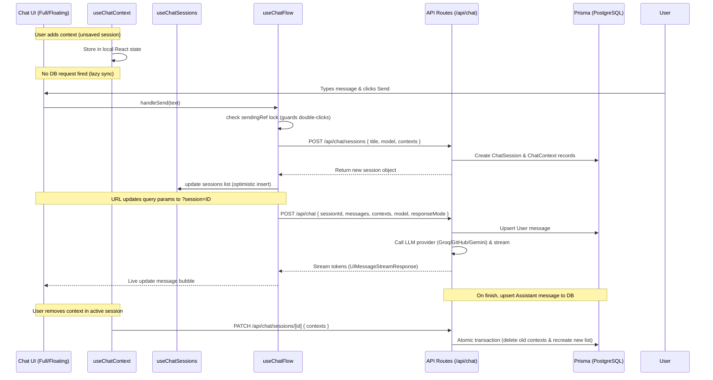

# Chat Interface
> **Feature Status:** Implemented  
> **Feature ID:** `CHAT_INTERFACE`

---

## 🎯 Architectural Intent & Overview

The Chat Interface provides a multi-model AI global news analyst chat interface. It allows users to ask domain-specific analysis questions, query specific news items, and run context-grounded assessments.

There are two primary entry points in the system:
1. **Full-page Chat (`/chat`)**: A dedicated page containing session history, configuration options (response mode, model choice, adaptive thinking), context management, and voice mode support.
2. **Floating Overlay (`FloatingChat`)**: A minimized, Reddit-style chat sheet rendered globally, which can be pre-loaded with article context when opened from card buttons.

---

## 📚 Technical Architecture & Data Flow

### 1. State Ownership & React Hooks
* **`useChatFlow`**: Wraps the AI SDK `useChat` hook. Manages active streaming, message history, error parsing, and session creation (`ensureSession`/`createSession`). Includes a `sendingRef` guard to lock form submits.
* **`useChatSessions`**: Manages the list of active sessions, routes synchronization, session deletions (`DELETE`), and loading details on mount.
* **`useChatContext`**: Manages attached context items. Context changes are stored locally on unsaved chats, but trigger `PATCH` calls to synchronize with the database once a session ID is defined.

### 2. Database Synchronization
* **`POST /api/chat/sessions`**: Creates new `ChatSession` database records. Accommodates initial context attachments.
* **`PATCH /api/chat/sessions/[id]`**: Performs updates to model settings, titles, or active context arrays. Updates to `contexts` delete all existing items for that session and insert the updated array within a database transaction.
* **`POST /api/chat`**: Standard AI streaming endpoint. Upserts the user message, builds the context-grounded system prompt, queries the configured LLM, and streams back token chunks. Upon stream completion (`onFinish`), persists the assistant response.

---

## 🛠️ File Inventory

### 📁 Routing & Endpoints
| File | Directive | Role |
|------|-----------|------|
| [page.tsx](file:///home/mainu/programming/projects/automation/geopolitical-news-monitor/global-news-aggregator/frontend/app/chat/page.tsx) | Server Component | Suspended page shell syncing with search params. |
| [route.ts (chat)](file:///home/mainu/programming/projects/automation/geopolitical-news-monitor/global-news-aggregator/frontend/app/api/chat/route.ts) | API Router | Standard AI streaming endpoint (incorporates prompt engineering & RAG grounding). |
| [route.ts (sessions)](file:///home/mainu/programming/projects/automation/geopolitical-news-monitor/global-news-aggregator/frontend/app/api/chat/sessions/route.ts) | API Router | REST endpoint to create new chat sessions and fetch session histories. |
| [route.ts (session id)](file:///home/mainu/programming/projects/automation/geopolitical-news-monitor/global-news-aggregator/frontend/app/api/chat/sessions/%5Bid%5D/route.ts) | API Router | REST endpoint to fetch, PATCH contexts/settings, or archive (DELETE) sessions. |

### 📁 UI Components
| File | Directive | Role |
|------|-----------|------|
| [ChatInterface.tsx](file:///home/mainu/programming/projects/automation/geopolitical-news-monitor/global-news-aggregator/frontend/components/chat/ChatInterface.tsx) | `"use client"` | Page layout orchestrator; wires flow, sessions, and context hooks. |
| [ChatHeader.tsx](file:///home/mainu/programming/projects/automation/geopolitical-news-monitor/global-news-aggregator/frontend/components/chat/ChatHeader.tsx) | `"use client"` | Renders top navigation bar, model identifiers, and chat actions. |
| [ChatHistoryPanel.tsx](file:///home/mainu/programming/projects/automation/geopolitical-news-monitor/global-news-aggregator/frontend/components/chat/ChatHistoryPanel.tsx) | `"use client"` | History drawer panel managing list display, deletion, and redirection. |
| [ChatInput.tsx](file:///home/mainu/programming/projects/automation/geopolitical-news-monitor/global-news-aggregator/frontend/components/chat/ChatInput.tsx) | `"use client"` | Text input with model selector, response mode toggles, and voice button. |
| [MessageList.tsx](file:///home/mainu/programming/projects/automation/geopolitical-news-monitor/global-news-aggregator/frontend/components/chat/MessageList.tsx) | N/A | Scroll-tracked container that displays message bubbles. |
| [MessageBubble.tsx](file:///home/mainu/programming/projects/automation/geopolitical-news-monitor/global-news-aggregator/frontend/components/chat/MessageBubble.tsx) | `"use client"` | Renders text, reasoning logs, and citations (supports markdown). |
| [ContextPanel.tsx](file:///home/mainu/programming/projects/automation/geopolitical-news-monitor/global-news-aggregator/frontend/components/chat/ContextPanel.tsx) | `"use client"` | Collapsible desktop panel + mobile pills showing active context. |
| [ContextPickerModal.tsx](file:///home/mainu/programming/projects/automation/geopolitical-news-monitor/global-news-aggregator/frontend/components/chat/ContextPickerModal.tsx) | `"use client"` | Renders search-driven popup to select news articles/topics. |
| [FloatingChat.tsx](file:///home/mainu/programming/projects/automation/geopolitical-news-monitor/global-news-aggregator/frontend/components/chat/FloatingChat.tsx) | `"use client"` | Global overlay panel with simplified layouts. |
| [ChatFAB.tsx](file:///home/mainu/programming/projects/automation/geopolitical-news-monitor/global-news-aggregator/frontend/components/chat/ChatFAB.tsx) | `"use client"` | Floating action button providing global access to the floating chat panel. |
| [CitationsStrip.tsx](file:///home/mainu/programming/projects/automation/geopolitical-news-monitor/global-news-aggregator/frontend/components/chat/CitationsStrip.tsx) | `"use client"` | Interactive tags linking responses to reference source materials. |
| [CollapsibleToolLogs.tsx](file:///home/mainu/programming/projects/automation/geopolitical-news-monitor/global-news-aggregator/frontend/components/chat/CollapsibleToolLogs.tsx) | `"use client"` | Renders expandable logs for multi-step agent reasoning/tool runs. |
| [VoiceSession.tsx](file:///home/mainu/programming/projects/automation/geopolitical-news-monitor/global-news-aggregator/frontend/components/chat/VoiceSession.tsx) | `"use client"` | Voice mode session overlay for microphone capture (currently mock-stubbed). |
| [WelcomeScreen.tsx](file:///home/mainu/programming/projects/automation/geopolitical-news-monitor/global-news-aggregator/frontend/components/chat/WelcomeScreen.tsx) | `"use client"` | Initial landing/welcome pane with starter suggestions. |

### 📁 Custom React Hooks
| File | Directive | Role |
|------|-----------|------|
| [useChatFlow.ts](file:///home/mainu/programming/projects/automation/geopolitical-news-monitor/global-news-aggregator/frontend/hooks/useChatFlow.ts) | `"use client"` | Triggers stream, manages errors, and governs session initiation. |
| [useChatSessions.ts](file:///home/mainu/programming/projects/automation/geopolitical-news-monitor/global-news-aggregator/frontend/hooks/useChatSessions.ts) | `"use client"` | Loads history list, handles session deletion, and handles route changes. |
| [useChatContext.ts](file:///home/mainu/programming/projects/automation/geopolitical-news-monitor/global-news-aggregator/frontend/hooks/useChatContext.ts) | `"use client"` | Manages context state, syncing deletions and additions dynamically. |

### 📁 Shared Utilities & Library Helpers
| File | Directive | Role |
|------|-----------|------|
| [contexts.ts](file:///home/mainu/programming/projects/automation/geopolitical-news-monitor/global-news-aggregator/frontend/lib/chat/contexts.ts) | N/A | Functions normalizing context structures for database/client layers. |
| [errors.ts](file:///home/mainu/programming/projects/automation/geopolitical-news-monitor/global-news-aggregator/frontend/lib/chat/errors.ts) | N/A | Processes and sanitizes multi-model API streaming errors. |
| [messages.ts](file:///home/mainu/programming/projects/automation/geopolitical-news-monitor/global-news-aggregator/frontend/lib/chat/messages.ts) | N/A | Formats message bubbles and generates auto-titles. |
| [messageCitations.ts](file:///home/mainu/programming/projects/automation/geopolitical-news-monitor/global-news-aggregator/frontend/lib/chat/messageCitations.ts) | N/A | Regex parser mapping generated outputs back to context source citations. |
| [embeddings.ts](file:///home/mainu/programming/projects/automation/geopolitical-news-monitor/global-news-aggregator/frontend/lib/ai/embeddings.ts) | N/A | Generates search query vector representations via Google AI Studio. |

---

## 🔒 Security & Optimization Best Practices

1. **Transactional Reconciliations:** Database updates to contexts use an atomic Prisma `$transaction` which prevents dangling database rows or stale lists on client refreshes.
2. **Dynamic UI Optimism:** The frontend does not wait for a full history re-fetch upon first message send. It optimistically inserts the session object directly into the local `sessions` state array.
3. **Tailwind Verification:** Icon layouts and badge sizing use standard tokens (such as arbitrary custom sizes `w-[18px]` and `h-[18px]`) to maintain visual fidelity and compatibility.
4. **Input Locks:** Double clicks on form submissions are guarded using a React `useRef(false)` flag to protect the session creation API from racing.
5. **Conversation Pruning Tradeoff (`MAX_TURNS`):** To control API latencies, token costs, and avoid exceeding LLM context windows (especially on models with tighter constraints like Groq), the payload sent to the LLM is truncated to the most recent `MAX_TURNS` messages. The complete history is preserved in the database and fully rendered in the UI, but the AI model will "forget" details from early turns in long conversations. If a different context-handling strategy (e.g. summarization or vector recall) is desired in the future, this is the policy to adjust.
