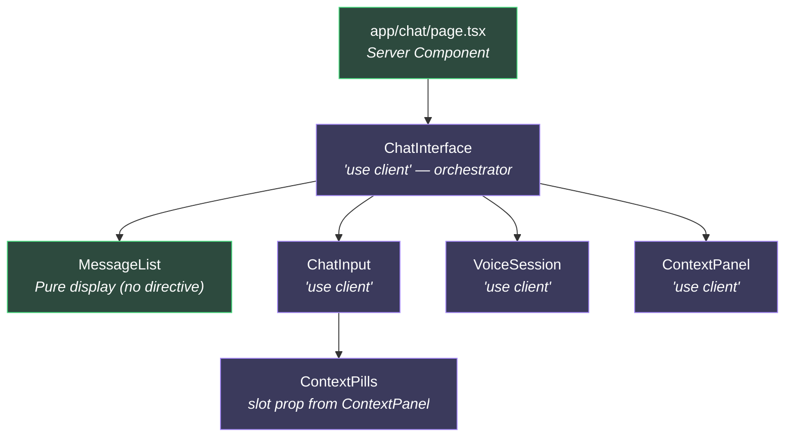
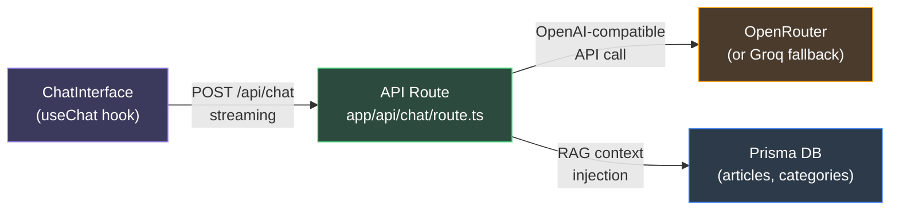
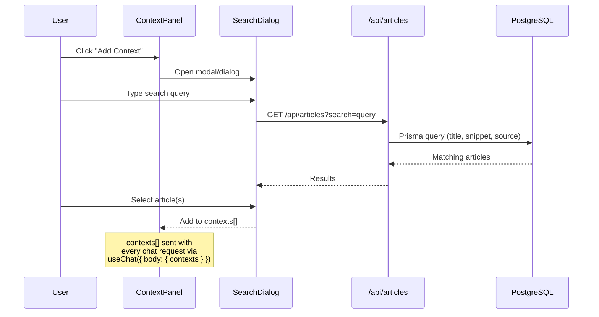

# Chat Interface
> **Feature Status:** Implementation Planned  
> **Feature ID:** `CHAT_INTERFACE`

---

## 📖 References Map
_(Items that require quick checkup, future plans, or jotting down)_

---

## 🎯 Current Direction
_(Always keep this section up-to-date. This outlines the current intentions and what we are actively trying to achieve with this feature. Before doing any tasks, we align with this intention.)_

The Chat Interface is currently a fully-built UI shell with stubs. The immediate goal is to wire up the Vercel AI SDK (v5) and create the streaming API route to bring the geopolitical AI assistant to life, enabling real conversations grounded in selected article context.

👉 **[Immediate Action Board](action-board.md)**

---

## ⏳ Explicitly Deferred (v2 / Future Notes)
_(Items that are good ideas but not required right now. When the Immediate Action Board is empty, these items move up into the Current Direction.)_

| Priority | Task | Effort | Files Touched |
|----------|------|--------|---------------|
| 🟢 **P2** | Chat-specific layout (hide footer) | 15 min | `app/chat/layout.tsx` |
| 🟢 **P2** | Chat persistence (Prisma models + session routes) | 2–3 hr | Schema, new routes |
| 🟢 **P2** | Rate limiting on `/api/chat` | 30 min | `route.ts` |
| 🟢 **P3** | Voice session with Web Speech API | 2–3 hr | `VoiceSession.tsx` |

---
---

## 📚 Technical Overview & Deep Dive
_(This section contains heavy schemas, architecture notes, and deep technical overviews. It is pushed to the bottom so it doesn't clutter the immediate action workflow. Update this occasionally when breaking changes or major architectural shifts occur.)_

### Table of Contents
- [Part 1: Architectural Audit](#part-1-architectural-audit)
  - [File Inventory](#file-inventory)
  - [Component Tree](#component-tree)
  - [Composition Pattern Verdict](#composition-pattern-verdict)
  - [Issues & Gaps](#issues--gaps)
  - [Next.js 16 Best-Practice Checklist](#nextjs-16-best-practice-checklist)
- [Part 2: AI Implementation Guide](#part-2-ai-implementation-guide)
  - [Recommended Stack](#recommended-stack)
  - [Phase 1 — API Route (Streaming)](#phase-1--api-route-streaming)
  - [Phase 2 — Client Hook (`useChat`)](#phase-2--client-hook-usechat)
  - [Phase 3 — Context-Grounded RAG](#phase-3--context-grounded-rag)
  - [Phase 4 — Persistence & History](#phase-4--persistence--history)
  - [Phase 5 — Error Handling & Rate Limiting](#phase-5--error-handling--rate-limiting)
  - [Phase 6 — Voice Session Integration](#phase-6--voice-session-integration)

---

## Part 1: Architectural Audit

### File Inventory

| File | Size | Directive | Role |
|------|------|-----------|------|
| [page.tsx](file:///home/mainu/programming/projects/automation/geopolitical-news-monitor/global-news-aggregator/frontend/app/chat/page.tsx) | 367 B | Server Component | Thin shell — metadata + renders `<ChatInterface>` |
| [ChatInterface.tsx](file:///home/mainu/programming/projects/automation/geopolitical-news-monitor/global-news-aggregator/frontend/components/chat/ChatInterface.tsx) | 7 KB | `"use client"` | Orchestrator — owns messages, context, voice-mode state |
| [ChatInput.tsx](file:///home/mainu/programming/projects/automation/geopolitical-news-monitor/global-news-aggregator/frontend/components/chat/ChatInput.tsx) | 4.5 KB | `"use client"` | Input bar — textarea, send, voice toggle, context pill slot |
| [MessageList.tsx](file:///home/mainu/programming/projects/automation/geopolitical-news-monitor/global-news-aggregator/frontend/components/chat/MessageList.tsx) | 2.2 KB | No directive | Pure display — renders message bubbles + scroll anchor |
| [ContextPanel.tsx](file:///home/mainu/programming/projects/automation/geopolitical-news-monitor/global-news-aggregator/frontend/components/chat/ContextPanel.tsx) | 5.8 KB | `"use client"` | Desktop sidebar + `ContextPills` (mobile) — context management UI |
| [VoiceSession.tsx](file:///home/mainu/programming/projects/automation/geopolitical-news-monitor/global-news-aggregator/frontend/components/chat/VoiceSession.tsx) | 9.6 KB | `"use client"` | Full-screen overlay — waveform visualizer, mic control, transcript |
| [types.ts](file:///home/mainu/programming/projects/automation/geopolitical-news-monitor/global-news-aggregator/frontend/components/chat/types.ts) | 1.6 KB | N/A | Shared types: `Message`, `ContextItem`, `VoiceStatus`, callbacks |

### Component Tree



### Composition Pattern Verdict

> [!TIP]
> **Overall: Well-structured.** The decomposition follows clean separation of concerns and is ready for real AI integration with relatively few changes.

#### ✅ What's Done Well

1. **Orchestrator Pattern** — `ChatInterface` acts as a pure state controller. It owns `messages`, `contexts`, and `isVoiceMode` centrally and delegates all rendering to child components via callbacks. This is exactly the right pattern for a chat UI where many sub-components need to coordinate.

2. **Slot-Based Composition** — `ContextPills` is passed as a `contextPillsSlot` prop to `ChatInput`. This avoids tight coupling and lets the desktop vs. mobile rendering strategy be controlled from the orchestrator level. This is an advanced, correct React pattern.

3. **Server → Client Boundary** — `page.tsx` is a proper Server Component (no `"use client"`, exports `metadata`). The client boundary is pushed one level down to `ChatInterface`. This means the route segment can leverage static metadata generation without pulling the entire tree client-side.

4. **MessageList as Pure Display** — `MessageList` has **no** `"use client"` directive and no hooks. It's a pure render function. The scroll-to-bottom logic is handled by the parent via `document.getElementById`, avoiding the need to make it a client component. This is a valid pattern.

5. **Voice Callback Interface** — `VoiceSessionCallbacks` is cleanly typed and designed as an integration surface. When a real STT/TTS API is wired, only the internal implementation of `VoiceSession` changes — the parent interface stays identical.

6. **Clear TODOs** — Every stub is marked with specific `// TODO` comments that document the exact API shape expected. This is excellent for handoff.

#### ⚠️ Issues & Gaps

| # | Severity | Issue | Detail |
|---|----------|-------|--------|
| 1 | 🔴 **Critical** | **No API route exists** | There is no `app/api/chat/route.ts`. The `handleSend` function is a `setTimeout` stub. This is the single biggest gap — without it, there is no AI. |
| 2 | 🔴 **Critical** | **No AI SDK installed** | `package.json` has no `ai`, `@ai-sdk/openai`, or `@ai-sdk/openrouter` dependency. The Vercel AI SDK (v5) is the standard for Next.js streaming chat. |
| 3 | 🟡 **Medium** | **`MessageList` is a false Server Component** | The comment says "Server component — no state, no hooks" but it's imported directly inside `ChatInterface` which is `"use client"`. **Any component imported from a client component is automatically a client component regardless of directives.** The label is misleading but functionally harmless — it still works correctly. However, it can never actually benefit from server-component semantics in this position. |
| 4 | 🟡 **Medium** | **Scroll via `document.getElementById`** | Using `getElementById` in a `useEffect` is a DOM escape hatch. It works, but `useRef` + `scrollIntoView` is more idiomatic React and survives concurrent rendering better. When switching to the AI SDK's `useChat`, the hook provides `scrollRef` utilities natively. |
| 5 | 🟡 **Medium** | **`INITIAL_MESSAGES` created at module scope with `new Date()`** | The `createdAt` timestamp is set once when the module loads, not when the component mounts. During development with HMR this is fine, but in production with server-side rendering or pre-rendering, this creates a hydration mismatch risk (server date ≠ client date). |
| 6 | 🟢 **Low** | **`uid()` uses `Date.now()` + `Math.random()`** | Fine for a stub, but when messages are persisted to a database, they'll need proper UUIDs. The AI SDK's `useChat` generates message IDs automatically. |
| 7 | 🟢 **Low** | **`AI_OPENROUTER_MODEL` is empty in `.env`** | The env var reserved for frontend AI is defined but has no model value. Need to set this (e.g., `google/gemini-2.5-flash` or `meta-llama/llama-4-scout-17b-16e-instruct`). |
| 8 | 🟢 **Low** | **No loading/streaming indicator** | There's no "typing" indicator, streaming text animation, or skeleton while the AI responds. The `setTimeout` stub instantly appends a complete message. |
| 9 | 🟢 **Low** | **No Markdown rendering** | `MessageBubble` renders `{message.content}` as plain text. AI responses typically contain markdown (headings, lists, code blocks). Need `react-markdown` or similar. |
| 10 | 🟢 **Low** | **Layout clash: Footer + full-height chat** | The root layout renders `<Footer />` after `{children}`. A chat page that needs `h-full` flex layout will have the footer pushed below or conflicting. May need a per-route layout override or a chat-specific layout segment. |

### Next.js 16 Best-Practice Checklist

| Practice | Status | Notes |
|----------|--------|-------|
| Server Component page with `metadata` export | ✅ | Correctly done |
| Client boundary pushed to first interactive component | ✅ | `ChatInterface` is the boundary |
| `cacheComponents: true` respected (no accidental caching) | ✅ | Chat page has no `'use cache'` (correct — chat is dynamic) |
| Suspense boundary for streaming | ✅ | Root layout wraps `{children}` in `<Suspense>` |
| API Route for server-side AI calls | ❌ | Missing entirely |
| Streaming response (ReadableStream / AI SDK) | ❌ | Not implemented |
| Error boundary for chat failures | ❌ | No `error.tsx` in `/chat` segment |
| Loading state for route transition | ❌ | No `loading.tsx` in `/chat` segment |
| URL-driven state (consistent with rest of app) | N/A | Chat state is inherently ephemeral, client-local state is appropriate |

---

## Part 2: AI Implementation Guide

### Recommended Stack



**Core dependency:** [Vercel AI SDK 5](https://ai-sdk.dev) — the de facto standard for Next.js AI streaming.

| Package | Purpose |
|---------|---------|
| `ai` | Core SDK — `streamText`, message types, streaming utilities |
| `@ai-sdk/openai` | OpenAI-compatible provider (works with OpenRouter & Groq via `baseURL`) |

> [!IMPORTANT]
> **Why AI SDK 5 over raw `fetch`?** It handles SSE parsing, backpressure, abort signals, message format normalization, token counting, tool calls, and client-side state management — all battle-tested. Rolling your own streaming chat client is a common source of subtle bugs (partial UTF-8 chunks, connection drops, race conditions on rapid sends).

---

### Phase 1 — API Route (Streaming)

Create `app/api/chat/route.ts`:

```typescript
import { streamText } from "ai";
import { createOpenAI } from "@ai-sdk/openai";

// Use OpenRouter (OpenAI-compatible) for frontend chat
const openrouter = createOpenAI({
  baseURL: process.env.AI_OPENROUTER_BASE_URL!,
  apiKey: process.env.AI_OPENROUTER_API_KEY!,
});

const SYSTEM_PROMPT = `You are a senior geopolitical analyst AI embedded in a global news aggregator.
Your role:
- Analyze geopolitical events, trends, and their implications
- Provide multi-perspective analysis (Western, Eastern, Global South viewpoints)
- Cite specific events, dates, and actors when possible
- Flag potential biases in narratives
- Be concise but thorough — prefer structured responses with headers and bullet points

You have access to the user's context items (articles, topics) when provided.
Ground your analysis in the provided context when available.
If you don't have enough information, say so rather than speculating.`;

export async function POST(req: Request) {
  const { messages, contexts } = await req.json();

  // Build context-augmented system prompt
  let systemPrompt = SYSTEM_PROMPT;
  if (contexts?.length > 0) {
    const contextBlock = contexts
      .map((c: { title: string; type: string; url?: string }) =>
        `- [${c.type}] "${c.title}"${c.url ? ` (${c.url})` : ""}`
      )
      .join("\n");
    systemPrompt += `\n\nThe user has attached the following context items for this conversation:\n${contextBlock}\nUse these to ground your analysis.`;
  }

  const result = streamText({
    model: openrouter(process.env.AI_OPENROUTER_MODEL || "google/gemini-2.5-flash"),
    system: systemPrompt,
    messages,
    maxTokens: 2048,
    temperature: 0.7,
  });

  return result.toDataStreamResponse();
}
```

**Key design decisions:**
- Uses `streamText` for server-sent streaming — tokens arrive at the client as they're generated
- System prompt establishes the geopolitical analyst persona
- Context items are injected into the system prompt for RAG-lite grounding
- `toDataStreamResponse()` returns the AI SDK's wire format that `useChat` understands

---

### Phase 2 — Client Hook (`useChat`)

Refactor `ChatInterface.tsx` to use the AI SDK's `useChat` hook:

```typescript
"use client";

import { useChat } from "ai/react";
import { useState, useCallback } from "react";
// ... other imports stay the same

export default function ChatInterface() {
  const [contexts, setContexts] = useState<ContextItem[]>([]);
  const [isVoiceMode, setIsVoiceMode] = useState(false);

  const {
    messages,
    input,
    setInput,
    handleSubmit,
    handleInputChange,
    isLoading,
    error,
    reload,
    stop,
  } = useChat({
    api: "/api/chat",
    body: { contexts },              // Sent with every request
    initialMessages: [{
      id: "init-1",
      role: "assistant",
      content: "Hello! I am your AI geopolitical analyst. How can I help you today?",
    }],
    onError: (err) => {
      console.error("Chat error:", err);
      // Could show toast via sonner
    },
  });

  // ... rest of the component
}
```

**What `useChat` replaces:**
- ❌ `useState<Message[]>` → ✅ `messages` from hook
- ❌ `appendMessage()` + `uid()` → ✅ handled internally
- ❌ `handleSend` with `setTimeout` → ✅ `handleSubmit` (or manual `append`)
- ❌ `scrollIntoView` via `getElementById` → ✅ can use the hook's controlled approach
- ❌ No loading state → ✅ `isLoading` boolean
- ❌ No error handling → ✅ `error` object + `reload()` for retry

**What stays the same:**
- `ChatInput` receives `onSend` (wired to `handleSubmit`)
- `MessageList` receives `messages` (same shape, compatible types)
- `ContextPanel` and `VoiceSession` stay unchanged
- The orchestrator pattern is preserved — `useChat` just replaces the manual state

---

### Phase 3 — Context-Grounded RAG

The current `addContext` is a hardcoded stub. The production implementation should:



**Implementation steps:**
1. Create a `<ContextSearchDialog>` component (shadcn `Dialog` + `Command` for search)
2. Wire it to the existing `GET /api/articles?search=` endpoint
3. When an article is selected, push to `contexts` state with the article's `title`, `url`, and `contentSnippet`
4. On the API route side, fetch the full article content from the DB using the context IDs and inject it into the system prompt

**Advanced RAG (Phase 3b):** Instead of just names in the system prompt, fetch the actual `contentSnippet` + `biasNote` + `sentimentScore` from the DB and inject them as structured context blocks. This gives the AI real data to reference.

---

### Phase 4 — Persistence & History

> [!NOTE]
> This is optional for MVP but recommended for production.

**Schema addition:**

```prisma
model ChatSession {
  id        String        @id @default(uuid())
  userId    String?
  title     String?       // Auto-generated from first message
  messages  ChatMessage[]
  createdAt DateTime      @default(now())
  updatedAt DateTime      @updatedAt

  user User? @relation(fields: [userId], references: [id])
}

model ChatMessage {
  id        String      @id @default(uuid())
  sessionId String
  session   ChatSession @relation(fields: [sessionId], references: [id], onDelete: Cascade)
  role      String      // "user" | "assistant" | "system"
  content   String      @db.Text
  createdAt DateTime    @default(now())

  @@index([sessionId])
}
```

**Route structure for multi-session chat:**
```
app/chat/
  page.tsx              → redirect to /chat/new or show session list
  [sessionId]/
    page.tsx            → load session from DB, pass to ChatInterface
  layout.tsx            → chat-specific layout (no footer, sidebar collapsed)
```

---

### Phase 5 — Error Handling & Rate Limiting

#### Error boundary
Create `app/chat/error.tsx`:
```typescript
"use client";
export default function ChatError({ error, reset }: { error: Error; reset: () => void }) {
  return (
    <div className="flex flex-col items-center justify-center h-full gap-4">
      <p className="text-destructive text-sm">Something went wrong: {error.message}</p>
      <button onClick={reset} className="px-4 py-2 bg-primary text-primary-foreground rounded-lg">
        Try again
      </button>
    </div>
  );
}
```

#### Rate limiting on the API route
```typescript
// Simple in-memory rate limiter (swap for Redis in production)
const rateLimiter = new Map<string, { count: number; resetAt: number }>();
const RATE_LIMIT = { maxRequests: 20, windowMs: 60_000 }; // 20 req/min

function checkRateLimit(ip: string): boolean {
  const now = Date.now();
  const entry = rateLimiter.get(ip);
  if (!entry || now > entry.resetAt) {
    rateLimiter.set(ip, { count: 1, resetAt: now + RATE_LIMIT.windowMs });
    return true;
  }
  if (entry.count >= RATE_LIMIT.maxRequests) return false;
  entry.count++;
  return true;
}
```

#### Streaming error recovery in `useChat`
```typescript
const { messages, error, reload } = useChat({
  onError: (err) => {
    toast.error("Failed to get AI response. Click retry.");
  },
});

// In the UI — show retry button when error is present
{error && (
  <button onClick={() => reload()}>Retry</button>
)}
```

---

### Phase 6 — Voice Session Integration

The `VoiceSession` component is well-structured with clear TODO markers. The integration path:

| Step | What | API |
|------|------|-----|
| 1 | Browser mic capture | `navigator.mediaDevices.getUserMedia({ audio: true })` |
| 2 | Speech-to-Text | Groq Whisper API (fast, free tier) or Web Speech API (browser-native, no cost) |
| 3 | Send transcript as chat message | `useChat`'s `append()` method |
| 4 | Text-to-Speech for AI response | Web Speech API `SpeechSynthesis` (free) or ElevenLabs/OpenAI TTS |

> [!TIP]
> **Cheapest viable voice pipeline:** Web Speech API for both STT and TTS. Zero API cost, works offline, good enough for a news analyst chatbot. Upgrade to Groq Whisper + ElevenLabs later for quality.


