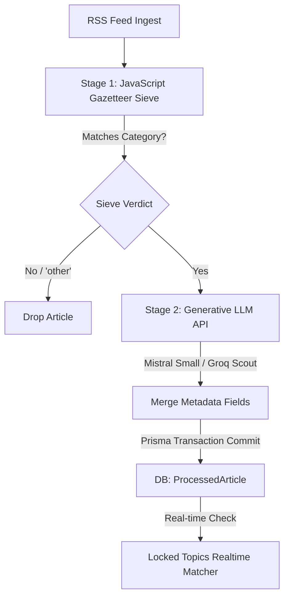

# Ingestion & Enrichment Pipeline

> **Feature Status:** Implemented (Evolution Planned)  
> **Feature ID:** `ENRICHMENT_PIPELINE`

---

## 📖 References Map
_(Items that require quick checkup, future plans, or jotting down)_

- **[Architectural Ledger: Ingestion Stage 2 API Migration](../enrichment_pipeline_api_migration.md)** — _Detailed trade-offs, options evaluated, and trajectory implications of migrating Stage 2 from Python FastAPI (GLiNER/VADER) to Mistral and Groq APIs._
- **[AI Model Strategy Guide](../AI_MODELS.md)** — _Definitive model assignments across the stack, detailing Mistral AI, Groq, and Google AI Studio usage for optimal speed, intelligence, and cost._

---

### 📖 Table of Contents

- [[#1. Overview & Objective]]
- [[#3. Research & Decision Matrix]]
- [[#4. Technical Architecture & Data Model]]
- [[#5. Implementation Notes & Reference Guide]]
- [[#6. Future Roadmap & "Remember It" Notes]]
- [[#7. Frontend Refactoring Guidelines (Staged)]]
- [[#8. Brainstorming & Feature Ideas]]

---

## 1. Overview & Objective

The **Enrichment Pipeline** is the core parsing engine of the Global News Aggregator. It processes raw RSS news articles, extracts structural metadata, and performs Natural Language Processing (NLP) to classify topics, map geographic footprints, and calculate sentiment.

By categorizing news across specific geopolitical axes, the pipeline allows users to understand the "Perspective Gap" (e.g., contrasting state-aligned reports with commercial feeds).

### Strategic Metadata Taxonomy

The system divides metadata into two groups to isolate **what happened** (event coordinates) from **who is telling the story** (publisher identity):

| Group                                                            | Field Name                                                        | Description                                                                                                                                                                                          | Source                                                  |
| :--------------------------------------------------------------- | :---------------------------------------------------------------- | :--------------------------------------------------------------------------------------------------------------------------------------------------------------------------------------------------- | :------------------------------------------------------ |
| **Group A: Publisher Identity** _(Who is talking?)_              | `sourceCountry`<br>`sourceType`<br>`biasGroup`<br>`coverageScope` | Home country of outlet (e.g., USA, Russia)<br>Publisher model (e.g., State Media, Commercial)<br>Ideological leaning (e.g., State-Aligned, Centrist)<br>Reporting footprint (e.g., Global, Regional) | Static (configured manually in `feeds.js` per RSS feed) |
| **Group B: Event Intelligence** _(What are they talking about?)_ | `eventRegion`<br>`categories`<br>`entities`<br>`sentimentScore`   | Geopolitical bloc where the event takes place<br>Topics (e.g., geopolitics, economy, business)<br>Extracted actors (PERSON, ORG, GPE, LOC)<br>Reporting tone polarity (-1.0 to +1.0)                 | Dynamic (generated for every article by the pipeline)   |

### Scope Boundaries

- **Micro-Batching:** To protect memory limits (512MB RAM constraints on the FastAPI service), articles are buffered and processed in batches of 30.
- **Graceful Degradation:** If the Python NLP service crashes or goes offline, Stage 2 yields empty entities and null sentiment, allowing ingestion to continue without blocking.

---

## 3. Research & Decision Matrix

### Dimensional Falsification Matrix (Stage 1 Router)

We evaluated whether to sieve out irrelevant articles using a regex compiled list (gazetteer) or a local machine learning classifier.

| Vector                     | Regex Gazetteer (Chosen)                                                                                  | Local ML Classifier (Disproven)                                                                                   |
| :------------------------- | :-------------------------------------------------------------------------------------------------------- | :---------------------------------------------------------------------------------------------------------------- |
| **Efficacy & Determinism** | ✅ **100% predictable.** Word boundary checks (`\b`) prevent substring bleeding. Acts as a perfect sieve. | ❌ **High semantic but unpredictable.** "Black box" classification makes debugging category mismatches difficult. |
| **Operational Overhead**   | ✅ **~0MB RAM.** Executes in microseconds; keeps the Node.js event loop unblocked.                        | ❌ **High.** Requires loading a model (50MB+) and running synchronous inference on Node.js thread.                |
| **Scope Realism**          | ✅ **Perfect fit.** Simply filters out junk (`other`) before Stage 2. Cost-free.                          | ❌ **Over-engineered.** Heavy NLP tasks are already delegated downstream.                                         |

### Dimensional Falsification Matrix (Stage 2 NLP Engine)

We evaluated local spaCy configurations, transformer zero-shot models (GLiNER), and generative LLM APIs.

| Model / Approach                                                       | RAM Footprint (Max Load) | Entity Extraction Quality                                                                          | Falsification Verdict                                                                                               |
| :--------------------------------------------------------------------- | :----------------------- | :------------------------------------------------------------------------------------------------- | :------------------------------------------------------------------------------------------------------------------ |
| **spaCy `en_core_web_md`**                                             | **~386 MB**              | ⚠️ **Medium** (Knowledge cut-off; misses newer entities like "Anthropic")                          | **Disproven** (High memory overhead; still misses 57% of region mappings).                                          |
| **spaCy `en_core_web_lg`**                                             | **~771 MB**              | ⚠️ **Medium** (More descriptive but double the RAM footprint; violates Render's 512MB RAM ceiling) | **Disproven** (Causes immediate Out Of Memory container crashes).                                                   |
| **GLiNER Zero-Shot** (`urchade/gliner_small-v2.1`)                     | **~861.48 MB**           | ✅ **High** (Extracts modern, context-heavy entities out of the box)                                | **Disproven** (RAM requirement violates 512MB RAM free-tier ceiling).                                               |
| **Generative LLM API** (Mistral small 2506 / Groq - llama 4 scout 17b) | ✅ **0 MB** (Local)       | ✅ **Excellent** (Up-to-date knowledge; highly accurate classifications)                            | **Validated (Next Evolution)** (Zero RAM overhead, zero local maintenance, resolves semantic entities dynamically). |

---

## 4. Technical Architecture & Data Model

The pipeline utilizes a two-stage hybrid architecture:

- **Stage 1 (Node.js):** Fast, deterministic JavaScript keyword sieve. Categorizes articles and extracts regions using weights and exclusions from `gazetteer.json`. Non-matching articles are labeled `other` and dropped.
- **Stage 2 (LLM API):** Invokes generative LLM APIs (`mistral-small-2506` on Mistral as primary; `llama-4-scout-17b` on Groq as fallback) to extract entities, score sentiment, and analyze narrative bias.

### Data Model (Prisma Schema)

```prisma
model ProcessedArticle {
  id             String           @id @default(uuid())
  rawArticleId   String           @unique
  rawArticle     RawArticle       @relation(fields: [rawArticleId], references: [id], onDelete: Cascade)
  categories     Category[]       @relation("ProcessedArticleCategories")
  entities       String[]         // Extracted actors
  sentimentScore Float?           // VADER compound polarity (-1.0 to 1.0)
  biasNote       String?          // Inherited feed bias notes
  eventRegion    String?          // Geopolitical region of event (e.g. Middle East)
  model          String?
  processedAt    DateTime         @default(now())
}
```

### Process Flow



---

## 5. Implementation Notes & Reference Guide

### Key Code Artifacts

- [config/ai.js](file:///home/mainu/programming/projects/automation/geopolitical-news-monitor/global-news-aggregator/ingestion-service/config/ai.js) — Centralized configuration for primary and fallback LLM client connections.
- [constants/categories.js](file:///home/mainu/programming/projects/automation/geopolitical-news-monitor/global-news-aggregator/ingestion-service/constants/categories.js) — Canonical list of allowed categorization topics.
- [processor.js](file:///home/mainu/programming/projects/automation/geopolitical-news-monitor/global-news-aggregator/ingestion-service/ai/processor.js) — Manages the dual-stage lifecycle, batching, and transactional DB commits.
- [stage1.js](file:///home/mainu/programming/projects/automation/geopolitical-news-monitor/global-news-aggregator/ingestion-service/ai/stage1.js) — Compiles and executes regular expressions from the Gazetteer.
- [gazetteer.json](file:///home/mainu/programming/projects/automation/geopolitical-news-monitor/global-news-aggregator/ingestion-service/data/gazetteer.json) — Config-driven dictionary defining weights and exclusions for category/region mapping.
- [stage2.js](file:///home/mainu/programming/projects/automation/geopolitical-news-monitor/global-news-aggregator/ingestion-service/ai/stage2.js) — Client connector invoking external LLM APIs (Mistral/Groq).
- [enrichment.js](file:///home/mainu/programming/projects/automation/geopolitical-news-monitor/global-news-aggregator/ingestion-service/ai/prompts/enrichment.js) — Modular system prompt and message template definition.
- [main.py](file:///home/mainu/programming/projects/automation/geopolitical-news-monitor/global-news-aggregator/enrichment-service/main.py) — (Deprecated) Python FastAPI endpoint running GLiNER and VADER.
- [utils.ts](file:///home/mainu/programming/projects/automation/geopolitical-news-monitor/global-news-aggregator/frontend/lib/utils.ts) — Frontend utility mapping publisher country strings to macro geopolitical regions in-memory.

---

## 6. Future Roadmap & "Remember It" Notes

- **Migrating Stage 2 to Gemini API:**
  To bypass the local RAM constraint (~860 MB for GLiNER) and support zero-cost hosting configurations, we plan to migrate Stage 2 to Google AI Studio's API using `gemini-2.5-flash` or `gemini-3.1-flash-lite` (defined in `docs/AI_MODELS|AI_MODELS.md`). This shifts NLP requirements off the local server entirely, resolving memory leaks and container OOM crashes.
- **Stage 2 Microservice Architecture Shift:**
  Stage 2 is planned to change from a standalone HTTP microservice. Future refinements may involve executing queries directly inside the main Node.js worker via serverless cloud endpoints or direct API calls.
- **Elimination of `sourceOrigin` Fallback:**
  The ingestion worker has been updated to remove the fallback that assigned the publisher's origin region as the event region in `stage1.js` if no country keywords matched. If Stage 1 cannot determine a region from the text, `eventRegion` remains `null`.

---

## 7. Frontend Regional Resolution (Implemented)

### The `sourceOrigin` Deletion Impact

The database column `sourceOrigin` was completely deleted from `RawArticle` to normalize the schema. The frontend successfully resolved this via in-memory derivation:

1. **Dynamic Regional Lookup (`frontend/lib/utils.ts`):**
   The `getPublisherRegion(country)` helper mirrors the static country-to-region mapping:
   ```typescript
   export const COUNTRY_TO_REGION: Record<string, string> = {
     "Bangladesh": "Asia-Pacific",
     "USA": "North America",
     "Qatar": "Middle East",
     // ...
   };
   ```
2. **PerspectiveWidget & Donut Charts (`frontend/queries/analytics.ts`):**
   Instead of using Prisma `groupBy` directly on the origin, the analytics query groups by `sourceCountry` and then maps to regions in-memory, aggregating the counts dynamically for the donut charts.
3. **Region Filtering Queries (`frontend/queries/articles.ts`):**
   When the user filters by region (e.g. `?origin=Asia-Pacific`), the query parses the `COUNTRY_TO_REGION` map backwards to extract the list of matching countries (e.g., `["Bangladesh", "India", "China"]`), and executes a Prisma `in` array comparison on the `sourceCountry` field:
   ```typescript
   const matchingCountries = Object.entries(COUNTRY_TO_REGION)
     .filter(([_, regionVal]) => regionVal.toLowerCase() === origin.toLowerCase())
     .map(([country]) => country);
   originFilter = [{ rawArticle: { sourceCountry: { in: matchingCountries } } }];
   ```

---

## 8. Brainstorming & Feature Ideas

- **Soft Power Cultural Widget:** A widget tracking the velocity of `PRODUCT` or `EVENT` entities across lifestyle and business feeds to measure the rise and fall of cultural soft power.
- **Real-Time Entity Anomaly Warnings:** Alert admins if a specific entity (e.g., a politician's name or a state agency) experiences a 500% spike in frequency across multiple regions, pointing to a developing crisis before a story cluster is fully formed.

## 🔗 Related Logs
_(Historical decisions, audits, and performance metrics that do not require quick checkups)_

- **[Rate-Limit-Aware AI Processing Log](../Rate-Limit-Aware%20AI%20Processing%20&%20Token%20Estimation%20Fix.md)** — _Analysis of estimation token adjustments under Groq RPM ceilings._
- [[nlp_model_falsification_matrix]] — _Comparison of local spaCy model fine-tuning vs zero-shot GLiNER and LLMs._
- [[nlp_baseline_audit]] — _Detailed baseline audits measuring extraction failures and RAM consumption on en_core_web_md vs en_core_web_lg._
- [[nlp_gliner_experiment_results]] — _Performance and RAM telemetry for GLiNER zero-shot model checks._
- [[stage1_gazetteer_tradeoffs]] — _Engineering tradeoffs ledger selecting Regex Gazetteer over Local ML Router._
- [[stage1_gazetteer_upgrades_tradeoffs]] — _Analysis of weighted keyword scores, exclusion list regex, and YAML/JSON configs._
