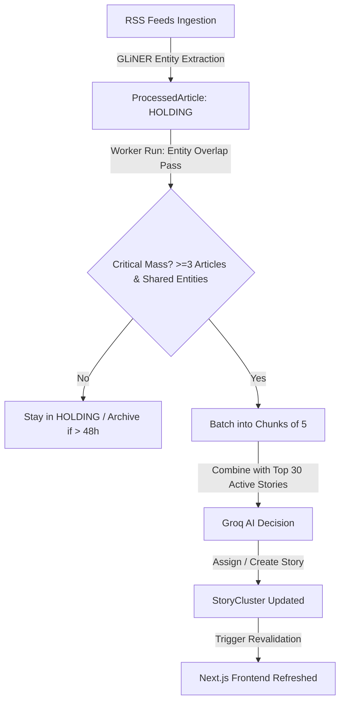

# Story Clustering

> **Feature Status:** Implemented (Maintenance & Evolution)  
> **Feature ID:** `STORY_CLUSTERING`

---

## 🔗 Related Logs & References Map

- [[docs/2. my_notes_&_drafts/Story clustering process evaluation|Story clustering process evaluation]] — *Detailed analysis log of clustering thresholds, duplicate groupings, and decay parameters.*
- [[docs/archive_dump/STORY_FEATURE|STORY_FEATURE]] — *High-level overview of the evolving story clustering logic.*
- [[docs/archive_dump/STORIES_ARCHITECTURE|STORIES_ARCHITECTURE]] — *Technical architecture details of the clustering worker.*
- [[docs/clustering_foundation_fixes|clustering_foundation_fixes]] — *Developer log documenting the decoupling of the clustering pipeline from ingestion.*

---

### 📖 Table of Contents
- [[#1. Overview & Objective]]
- [[#3. Research & Decision Matrix]]
- [[#4. Technical Architecture & Data Model]]
- [[#5. Implementation Notes & Reference Guide]]
- [[#6. Future Roadmap & "Remember It" Notes]]
- [[#7. Brainstorming & Feature Ideas]]

---

## 1. Overview & Objective

The **Story Clustering** feature acts as the "Global Billboard" of the platform. Instead of presenting a raw, unfiltered firehose of individual news articles, it groups redundant, overlapping, or related reports from different publishers into cohesive, evolving geopolitical narratives called **Stories**.

### Why It Exists
- **Information Overload:** A major event (e.g., peace talks, a natural disaster, or geopolitical skirmishes) triggers dozens of articles from different outlets, cluttering the feed.
- **Perspective Highlight:** Grouping articles into clusters allows the frontend to contrast coverages, showing the "Perspective Gap" (e.g., state media vs. commercial media).
- **Token Efficiency:** Raw news is ingested constantly. By grouping articles locally before hitting an LLM, the system processes groups in batches, protecting against rate limits.

### Scope Boundaries
- **Dynamic Cluster Lifecycle:** Stories dynamically emerge, scale in momentum, decay if coverage drops, and auto-archive.
- **Top 30 Active Cap:** The frontend and active LLM context strictly maintain only the top 30 active stories. Older/colder stories are archived.

---

## 3. Research & Decision Matrix

### Dimensional Falsification Matrix

| Candidate Solution | Efficacy & Determinism | Operational Cost / Latency | Complexity / Debt | Outcome / Verdict |
| :--- | :--- | :--- | :--- | :--- |
| **Option A: Ingestion-Time LLM Clustering** (Clustering every article immediately using LLM) | ❌ **Low** (Highly prone to premature categorization, duplicate story creation, and context limit fatigue) | ❌ **High** (Constant API requests to LLM, high token cost) | ⚠️ **Medium** | **Disproven** (Unpredictable & costly) |
| **Option B: Pure Local TF-IDF / NLP Clustering** (Group purely using offline word similarities) | ❌ **Medium** (High speed but misses semantic nuances; hard to extract high-quality titles/summaries without LLM) |  **Low** (Completely offline, near zero cost) | ⚠️ **Medium** (Requires tweaking NLP thresholds constantly) | **Disproven** (Fails to create high-quality readable summaries) |
| **Option C: Decoupled Entity-Matching + LLM Batching** (Deterministic local entity filtering first, followed by batch LLM decisions) |  **High** (Entity matching groups candidate articles locally. LLM only performs final categorization and summaries) |  **Medium** (LLM is called in batches only when critical mass is met; rate limits are respected) |  **Low** (Clean separation of concerns, stable) | **Accepted** (Current Implementation) |

---

## 4. Technical Architecture & Data Model

To prevent API rate limits, network crashes, and LLM amnesia, the system uses a **Decoupled Architecture**: Ingestion and Clustering run as asynchronous, independent processes.

### Data Model (Prisma Schema)

```prisma
model ProcessedArticle {
  id             String         @id @default(uuid())
  rawArticleId   String         @unique
  rawArticle     RawArticle     @relation(fields: [rawArticleId], references: [id], onDelete: Cascade)
  clusterStatus  String         @default("HOLDING") // HOLDING | CLUSTERED | ARCHIVED_UNCLUSTERED
  clusteredAt    DateTime?
  storyClusters  StoryCluster[] @relation("ArticleStoryClusters")
}

model StoryCluster {
  id             String             @id @default(uuid())
  slug           String             @unique
  title          String
  summary        String             @db.Text
  timeWindow     String?
  keyDevelopments Json?
  isActive       Boolean            @default(true)
  impact         String?
  impactScore    Float?
  status         String?            @default("DEVELOPING") // EMERGING | DEVELOPING | SLOW_BURN | COOLING | ARCHIVED
  momentumScore  Float              @default(0)
  whyItMatters   String?            @db.Text
  regions        String[]
  themes         String[]
  articleCount   Int                @default(0)
  sourceCount    Int?
  topSources     String[]
  lastActivityAt DateTime?
  activityScore  Float?
  trendData      Json?
  createdAt      DateTime           @default(now())
  updatedAt      DateTime           @updatedAt
  articles       ProcessedArticle[] @relation("ArticleStoryClusters")
}
```

### Process Flow
1. **Ingestion & Holding Tank:** `npm run ingest` crawls new articles, runs local NLP (GLiNER entity extraction), and writes them as `HOLDING`.
2. **Entity Overlap Detection:** The worker (`npm run cluster`) checks `HOLDING` articles from the last 48 hours. It groups articles sharing at least **2 identical entities** (e.g., both mention `"Emmanuel Macron"` and `"Paris"`).
3. **Critical Mass Check:** If a group contains at least **3 articles**, it proceeds. Others remain in `HOLDING` (until they expire after 48h).
4. **Token-Safe Chunking:** Grouped articles are sliced into batches of 5.
5. **LLM Categorization:** Groq (Llama 3.3 70b or fallbacks defined in `AI_MODELS.md`) is prompted with the Top 30 Active Stories + 5 New Articles. It decides whether to attach them to an existing story or spawn a new one.
6. **Database Write & Revalidation:** Articles are marked as `CLUSTERED`. The worker decays active story momentum, archives stories below the cap, and calls the Next.js API revalidation hook to refresh the frontend.



---

## 5. Implementation Notes & Reference Guide

### Key Code Artifacts
- [runClustering.js](file:///home/mainu/programming/projects/automation/geopolitical-news-monitor/global-news-aggregator/ingestion-service/runClustering.js) — The main orchestrator of the clustering pipeline.
- [client.js](file:///home/mainu/programming/projects/automation/geopolitical-news-monitor/global-news-aggregator/ingestion-service/ai/client.js) — Houses `processClusteringBatchWithAI` (prompt building & Groq connection).
- [processor.js](file:///home/mainu/programming/projects/automation/geopolitical-news-monitor/global-news-aggregator/ingestion-service/ai/processor.js) — Extracts LLM outputs and saves/updates DB structures.
- [schema.prisma](file:///home/mainu/programming/projects/automation/geopolitical-news-monitor/global-news-aggregator/prisma/schema.prisma) — Database schema definition.

### Key Execution Commands
- **Run Ingestion:** `npm run ingest` (Run first to seed raw inputs).
- **Run Clustering Worker:** `npm run cluster` (Executes the clustering logic on `HOLDING` articles).

---

## 6. Future Roadmap & "Remember It" Notes

- **The Context Window Wall:** Currently, we pass the Top 30 Active Stories into the prompt. As the database grows or summaries get longer, this can hit the LLM token constraints.
- **Clustering Upgrade (Embeddings + Vector DB):**
  - The planned upgrade shifts this to a hybrid model.
  - **Proposed Flow:** Convert ingested articles to vectors using Gemini Embeddings and store them in Supabase `pgvector`.
  - Use Cosine Similarity to determine article-to-article groups and article-to-story mappings.
  - Use the LLM *exclusively* to write, update, and summarize the resulting cluster metadata, rather than choosing clustering paths. This drastically reduces token usage and allowing infinite scale.
- **Model Alignment:**
  - Standard prompt generation relies on models registered in [[docs/AI_MODELS|AI_MODELS.md]]. If migrating tasks to Google AI Studio, utilize `gemini-2.5-flash` or `gemini-3.1-flash-lite` instead of obsolete Gemini 1.5 variants.

---

## 7. Brainstorming & Feature Ideas

- **Side-by-Side Coverage Compare:** Provide a UI view where users click a Story and compare the news coverage of state media vs. commercial outlets side-by-side on a timeline.
- **Multi-lingual Cluster Detection:** Enable the python microservice to translate/normalize entities across different languages so foreign sources can easily cluster with domestic articles.
- **Interactive Story Timelines:** Generate milestone timelines automatically from the chronological developments of a cluster.
