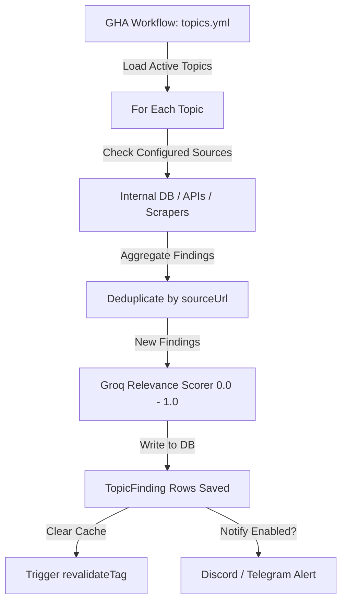

# Locked Topics

> **Feature Status:** Implemented  
> **Feature ID:** `LOCKED_TOPICS`

---

## 📖 References Map

_(Items that require quick checkup, future plans, or jotting down)_

---

### 📖 Table of Contents
- [[#1. Overview & Objective]]
- [[#3. Research & Decision Matrix]]
- [[#4. Technical Architecture & Data Model]]
- [[#5. Implementation Notes & Reference Guide]]
- [[#6. Future Roadmap & "Remember It" Notes]]
- [[#7. Brainstorming & Feature Ideas]]

---

## 1. Overview & Objective

**Locked Topics** is a manual, intentional tracking system. Unlike Stories (which are dynamically auto-assembled by AI from the ingestion feed), Locked Topics are created explicitly by users for specific investigative or monitoring purposes. 

The system behaves like a dedicated researcher: it runs scans every 2 hours across all configured sources, parses the results, filters them for relevance using an AI model, and presents the findings in a structured feed.

### Why It Exists
- **Targeted Tracking:** Users need to follow highly specific narratives (e.g., "Google DeepMind Job Postings", "BD Government Procurement Changes", "Geopolitical border incidents") that might not form broad "Story Clusters" in the general news feed.
- **Persistent Memory:** Findings are kept indefinitely unless the topic itself is deleted or archived. They are never auto-purged by momentum decay.

### Scope Boundaries
- **No LinkedIn Scraping:** Avoids ToS issues.
- **Headline-Only for Paywalls:** Gathers paywalled articles (Reuters, Bloomberg) only via public RSS feeds or Google News headlines.
- **Background Scans:** Scans run in a batch cycle (~every 2 hours), not in real-time.
- **Single-User UI:** Database structure supports `userId`, but the current UI is single-tenant.

---

## 3. Research & Decision Matrix

### Dimensional Falsification Matrix

| Candidate Solution | Efficacy & Determinism | Operational Cost / Latency | Complexity / Debt | Outcome / Verdict |
| :--- | :--- | :--- | :--- | :--- |
| **Option A: Pure Scraped-Based Checking** (Writing custom HTML parsers for every web source) | ❌ **Low** (Extremely fragile; sites change class names frequently, breaking selectors) |  **Low** (Compute only, zero API cost) | ❌ **High** (Dozens of custom scrapers to maintain) | **Disproven** (Unstable) |
| **Option B: Multi-Source API & Feed Aggregation + AI Relevance Filter** (Use stable search APIs, RSS feeds, and a centralized LLM validator) |  **High** (Combines Google News, Brave Search, and Reddit APIs with AI relevance scoring) | ⚠️ **Medium** (Groq/Gemini calls for query refinement and finding scoring) |  **Low** (Maintains a small, clean list of generic API connectors) | **Accepted** (Current Implementation) |

---

## 4. Technical Architecture & Data Model

The feature consists of a Next.js 16 frontend (defining queries, settings, and viewing findings) and an asynchronous background runner (`processTopics.js` in `ingestion-service`) executed via GitHub Actions.

### Data Model (Prisma Schema)

```prisma
model LockedTopic {
  id                  String     @id @default(uuid())
  userId              String? // nullable — single user for now, ready for multi-user
  displayName         String
  userContext         String     @db.Text
  aiRefinedQuery      String     @db.Text
  aiQuerySummary      String     @db.Text
  conceptualKeywords  Json? // Array of keyword groups for broad pre-filtering
  liveWebSummary      String?    @db.Text
  liveSummary         String?    @db.Text
  sources             Json // SourceConfig[]
  searchBeyondSources Boolean    @default(true)
  isActive            Boolean    @default(true)
  notifyEnabled       Boolean    @default(false)
  notifyMode          NotifyMode @default(DIGEST)
  notifyThreshold     Float      @default(0.8)
  notifyChannels      Json // { discord: bool, telegram: boolean }
  matchCount          Int        @default(0)
  lastMatchedAt       DateTime?
  lastViewedAt        DateTime?
  lastScannedAt       DateTime? // null = initial scan not yet run (scanning state)
  createdAt           DateTime   @default(now())
  updatedAt           DateTime   @updatedAt
  findings            TopicFinding[]
}

model TopicFinding {
  id             String        @id @default(uuid())
  topicId        String
  topic          LockedTopic   @relation(fields: [topicId], references: [id], onDelete: Cascade)
  title          String
  summary        String?
  sourceType     FindingSource
  sourceUrl      String
  sourceName     String
  rawArticleId   String? // nullable — links to ProcessedArticle if internal
  relevanceScore Float?
  isRead         Boolean       @default(false)
  foundAt        DateTime      @default(now())
  metadata       Json? // { location, salary, company, etc. }

  @@unique([topicId, sourceUrl])
  @@index([topicId, foundAt])
  @@index([topicId, relevanceScore])
}

enum NotifyMode {
  DIGEST
  ALERT
}

enum FindingSource {
  ARTICLE
  GOOGLE
  BRAVE
  REDDIT
  RSS
  SCRAPE
  WEBPAGE
  GITHUB
  BD_GOV_JOBS
  COMPANY_CAREERS
  SEARCH
}
```

### Process Flow (Scanning Workflow)
Executed every 2 hours by `.github/workflows/topics.yml`:
1. **Load Active Topics:** Queries the database for `LockedTopic` rows where `isActive = true`.
2. **Execute Source Scanners:**
   - **Internal DB:** Queries `ProcessedArticle` using term matching (`aiRefinedQuery`).
   - **Google News RSS:** Hits `news.google.com/rss/search?q={query}`.
   - **Brave Search:** Calls the Brave Search API.
   - **Reddit:** Reads public search JSON feed.
   - **Web Scrapers / Webpage Diff:** Fetches target pages and checks for additions.
3. **Deduplication:** Filters out findings where `sourceUrl` already exists for this topic.
4. **AI Relevance Scoring:** Batches new finding titles into a Groq request. The LLM rates each on a `0.0` - `1.0` scale against the `aiRefinedQuery`.
5. **Save & Notify:** Writes new `TopicFinding` rows and triggers Discord/Telegram webhooks if score meets the threshold in `ALERT` mode.



---

## 5. Implementation Notes & Reference Guide

### Key Code Artifacts
- **Frontend Pages:**
  - [app/locked-topics/page.tsx](file:///home/mainu/programming/projects/automation/geopolitical-news-monitor/global-news-aggregator/frontend/app/locked-topics/page.tsx) — Main list page.
  - [app/locked-topics/[id]/page.tsx](file:///home/mainu/programming/projects/automation/geopolitical-news-monitor/global-news-aggregator/frontend/app/locked-topics/[id]/page.tsx) — Topic detail page.
- **Ingestion Worker Modules:**
  - [processTopics.js](file:///home/mainu/programming/projects/automation/geopolitical-news-monitor/global-news-aggregator/ingestion-service/processTopics.js) — Background runner entry point.
  - [scanner.js](file:///home/mainu/programming/projects/automation/geopolitical-news-monitor/global-news-aggregator/ingestion-service/topics/scanner.js) — Coordinates scanners.
  - [scorer.js](file:///home/mainu/programming/projects/automation/geopolitical-news-monitor/global-news-aggregator/ingestion-service/topics/scorer.js) — Groq relevance scorer.
- **Workflow configuration:**
  - [.github/workflows/topics.yml](file:///home/mainu/programming/projects/automation/geopolitical-news-monitor/global-news-aggregator/.github/workflows/topics.yml) — GHA runner config.

### API Endpoints
- `POST /api/locked-topics` — Create topic.
- `POST /api/locked-topics/ai-refine` — Generate initial refined queries via Gemini Flash.
- `PATCH /api/locked-topics/[id]` — Edit metadata/toggles.
- `DELETE /api/locked-topics/[id]` — Cascade deletes topic and findings.
- `POST /api/locked-topics/[id]/scan` — Run immediate internal DB scan.
- `POST /api/locked-topics/[id]/summary` — Groq-generated narrative summary of findings.
- `GET /api/locked-topics/[id]/findings?cursor=id` — Infinite scroll endpoint.

### Rendering & Caching Matrix
This feature uses Next.js 16 `'use cache'` with explicit cache tags:

| Page / Query | Fetch Mechanism | Invalidation Trigger |
| :--- | :--- | :--- |
| `getLockedTopics()` | Direct Prisma with `'use cache'` (Tag: `locked-topics`) | `updateTag('locked-topics')` in mutations (POST, PATCH, DELETE) |
| `getLockedTopicById(id)` | Direct Prisma with `'use cache'` (Tag: `locked-topic-id`) | `updateTag('locked-topic-id')` in mutations or revalidate API calls |
| Findings (initial 20) | Direct Prisma in Server Component | Fetched inline dynamically during page reload |
| Findings (infinite scroll) | Client API Route: `GET /api/locked-topics/[id]/findings` | Not cached |

---

## 6. Future Roadmap & "Remember It" Notes

- **Scraper Fragility:** Tier 2 HTML scrapers (like `bdGovJobs`) must be audited whenever the target site changes its design structure.
- **Notification Aggregations:** Daily digests are sent at 8 AM UTC. If a topic gets hundreds of findings, ensure the Discord/Telegram message does not exceed payload size limits (batch them in multiple messages if needed).
- **Archival Summaries:** When deleting or archiving, the final summary must be generated via Google AI Studio (`gemma-4-31b` or equivalent) to store a permanent summary record in the DB before purging finding rows to save DB space.

---

## 7. Brainstorming & Feature Ideas

- **Automatic Category Suggestions:** Have the AI recommend specific, localized feeds to add as Tier 3 sources based on the context description (e.g., recommending a particular ministry's notices page).
- **Sentiment Shift Alerts:** Trigger alerts if the average sentiment of findings about a topic changes sharply (e.g., coverage of a border area becomes suddenly negative).

---

## 🔗 Related Logs
_(Historical decisions, audits, and performance metrics that do not require quick checkups)_

- [[docs/archive_dump/locked-topics-implementation-guide|locked-topics-implementation-guide]] — *Full feature blueprint detailing modal forms, scraping configurations, and API structures from early implementation.*
