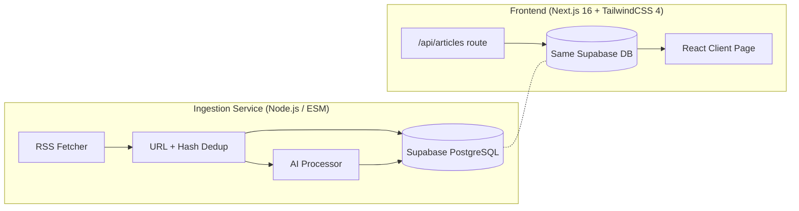

# Global News Aggregator — Project State

## Architecture Overview

The project is a **two-service monorepo** hosted on a single Git repo (`dev` branch active, 4 commits ahead of `main`):



| Layer | Tech Stack |
|---|---|
| **Database** | Supabase PostgreSQL, Prisma ORM v6.19 (root) / v7.8 (frontend) |
| **Ingestion** | Node.js ESM, `rss-parser`, `tiktoken`, `p-limit`, raw `fetch` for AI APIs |
| **AI Processing** | Groq (primary) + OpenRouter (fallback), batch prompt → JSON |
| **Frontend** | Next.js 16, React 19, TailwindCSS 4, shadcn/ui, Lucide icons |

---

## What's Working ✅

### Ingestion Pipeline (fully functional)
- **RSS streaming** from configured sources — currently only **The Daily Star (Bangladesh)** is active; 6+ others are commented out (Al Jazeera, Dhaka Tribune, UN News, TechCrunch, etc.)
- **Two-layer deduplication**: URL normalization + content hash (`title + contentSnippet`)
- **Database persistence**: new articles saved as `RawArticle` rows
- **AI batch processing**: articles are token-batched (~800 tokens/batch), sent to Groq/OpenRouter for categorization, entity extraction, sentiment scoring, and bias detection
- **Processed article storage**: AI results saved as `ProcessedArticle` with linked `Category` records
- **AI usage tracking**: token counts and estimated costs logged to `AiUsage` table
- **Resilience**: primary/fallback AI provider switching, rate-limit handling with `retry-after`, configurable timeouts and retry attempts
- **Latest run**: 10 articles fetched, 10/10 inserted, 10/10 AI-processed in 13.8s

### Database Schema (5 models, migrated)
| Model | Purpose |
|---|---|
| `RawArticle` | Raw RSS data with URL + content hash dedup |
| `ProcessedArticle` | AI enrichment (categories, entities, sentiment, bias, perspective countries) |
| `Category` | Many-to-many with ProcessedArticle |
| `User` / `UserTopic` | User alert subscriptions (schema only, not wired) |
| `AiUsage` | Per-batch AI cost/token tracking |

### Frontend (basic, functional)
- **API route** `/api/articles` — queries `ProcessedArticle` joined with `RawArticle` and `Category`, supports `?category=` and `?country=` filters
- **Client page** — card grid showing title, source, date, snippet, sentiment badge, bias note
- **Category filter dropdown** (hardcoded: all / geopolitics / bangladesh / technology)
- Dev server running on `localhost:3000`

---

## What's Partially Built / Rough Edges ⚠️

| Item | Status |
|---|---|
| **Prisma version mismatch** | Root uses `^6.19.3`, frontend uses `^7.8.0` — potential schema/client drift |
| **Frontend Prisma client** | Uses a separate [lib/prisma](file:///home/mainu/programming/projects/automation/geopolitical-news-monitor/global-news-aggregator/frontend/lib) (not the shared [lib/db.ts](file:///home/mainu/programming/projects/automation/geopolitical-news-monitor/global-news-aggregator/lib/db.ts)) — two separate Prisma setups |
| **Category filter** | Hardcoded options in the dropdown; not dynamically fetched from DB |
| **Frontend design** | Functional but basic — TailwindCSS card grid, no dark mode, no animations, "Testing ingestion workflow output" subtitle |
| **RSS sources** | Only 1 of 7+ sources enabled — the rest are commented out |
| **Ingestion scheduling** | Manual `node ingestion-service/index.js` — no cron, no n8n workflow, no scheduler |
| **`n8n-workflows/`** | Directory exists but is empty |
| **`infra/`** | Directory exists but is empty |
| **`docs/`** | Only `phase-0.md` written; no Phase 1+ documentation |

---

## What's Not Built Yet 🚧

- **User system** — `User` and `UserTopic` models exist in schema but nothing reads/writes them
- **Notifications** — no Discord/email alerts wired up (`.env.example` has `DISCORD_WEBHOOK_URL` placeholder)
- **Full-text search** — no search functionality on the frontend
- **Country/region filtering UI** — API supports `?country=` but no UI for it
- **Article detail view** — cards link directly to external source URLs
- **Automated scheduling** — no cron job, n8n workflow, or background scheduler
- **Deployment / CI/CD** — no Dockerfile, no GitHub Actions, no deployment config
- **Testing** — no tests (`"test": "echo \"Error: no test specified\""`)

---

## File Map

```
global-news-aggregator/
├── prisma/schema.prisma          # Shared DB schema (5 models)
├── prisma.config.ts              # Prisma connection config
├── lib/db.ts                     # Shared Prisma client singleton
├── package.json                  # Root deps (Prisma 6, rss-parser, tiktoken, etc.)
│
├── ingestion-service/
│   ├── index.js                  # Entry point — RSS fetch → dedup → DB → AI queue
│   ├── sources/rss.js            # RSS stream fetcher
│   ├── db/client.js              # Ingestion Prisma client
│   ├── ai/
│   │   ├── client.js             # AI API client (Groq/OpenRouter, fallback, rate limits)
│   │   ├── processor.js          # Batch queue, DB persistence of AI results
│   │   └── tokenBatcher.js       # Token-aware batching with tiktoken
│   └── utils/
│       ├── hashSnippet.js        # Content hash for dedup
│       └── normalizeUrl.js       # URL normalization
│
├── frontend/
│   ├── app/
│   │   ├── page.tsx              # Main UI — article card grid
│   │   ├── layout.tsx            # Root layout
│   │   ├── globals.css           # Tailwind + custom styles
│   │   └── api/articles/route.ts # GET /api/articles endpoint
│   ├── lib/                      # Frontend Prisma client
│   └── components/               # (shadcn/ui setup, minimal usage)
│
├── docs/phase-0.md               # Phase 0 completion notes
├── infra/                        # Empty — no deployment config yet
└── n8n-workflows/                # Empty — no automation workflows yet
```

---

## Summary

**You're at the end of Phase 1.** The core data pipeline works end-to-end: RSS → dedup → DB → AI enrichment → API → basic UI. The next natural steps would be:

1. **Enable more RSS sources** and stress-test the pipeline
2. **Schedule ingestion** (cron / n8n / background worker)
3. **Improve the frontend** — dynamic categories, search, dark mode, polish
4. **Wire up notifications** — Discord/email alerts for tracked topics
5. **Unify Prisma versions** across root and frontend
6. **Add tests and CI/CD**
