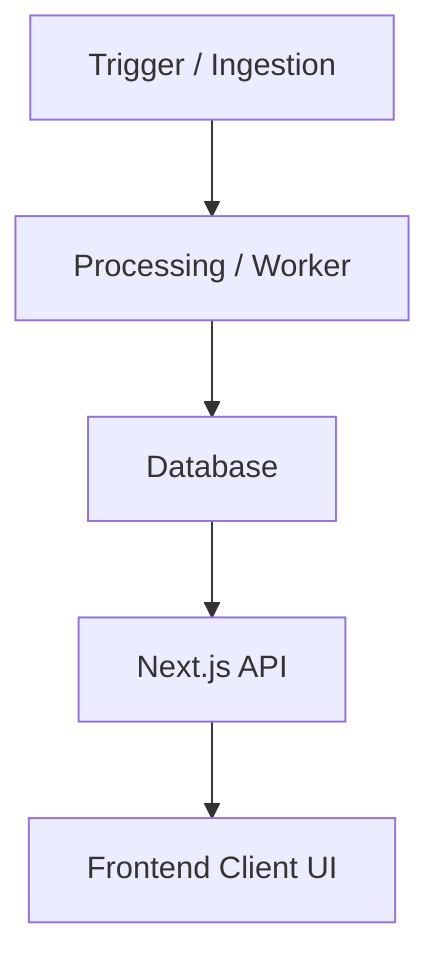

# [FEATURE_NAME]

> **Feature Status:** `[Brainstorming | Researching | Implementation Planned | In Progress | Implemented | Deprecated]`  
> **Feature ID:** `[UNIQUE_FEATURE_ID]` (e.g., `STORY_CLUSTERING`, `LOCKED_TOPICS`)

---

### 📖 Table of Contents

- [1. Overview & Objective](#1-overview--objective)
- [2. 📖 References Map](#2--references-map)
- [3. Research & Decision Matrix](#3-research--decision-matrix)
- [4. Technical Architecture & Data Model](#4-technical-architecture--data-model)
- [5. Implementation Notes & Reference Guide](#5-implementation-notes--reference-guide)
- [6. Future Roadmap & "Remember It" Notes](#6-future-roadmap--remember-it-notes)
- [7. Brainstorming & Feature Ideas](#7-brainstorming--feature-ideas)
- [8. 🔗 Related Logs](#8--related-logs)

---

## 1. Overview & Objective

Provide a high-level explanation of the feature from a product or user perspective:

- What is this feature?
- Why does it exist? (Problem solved)
- User persona, core flows, and key interactions.
- Scope boundaries (What is _not_ included or out-of-scope).

---

## 2. 📖 References Map

_(Items that require quick checkup, future plans, or jotting down)_

- [Reference Name](file:///path/to/reference/file.md) — _Description of reference._

---

## 3. Research & Decision Matrix

This section documents the research, candidate solutions, and falsification matrix that led to the chosen implementation path.

### Dimensional Falsification Matrix

| Candidate Solution | Efficacy & Determinism     | Operational Cost / Latency | Complexity / Debt       | Outcome / Verdict      |
| :----------------- | :------------------------- | :------------------------- | :---------------------- | :--------------------- |
| **Option A**       | _Pros/Cons of correctness_ | _API cost/Compute cost_    | _Maintenance footprint_ | _Accepted / Disproven_ |
| **Option B**       | _Pros/Cons of correctness_ | _API cost/Compute cost_    | _Maintenance footprint_ | _Accepted / Disproven_ |

> [!NOTE]
> Add background notes, external links to API documentations, research papers, or tools assessed during discovery.

---

## 4. Technical Architecture & Data Model

Explain the underlying technical architecture, data structures, and service flow.

### Data Model (Prisma / DB Schema)

Describe the database models, fields, and relations specific to this feature.

```prisma
// Relevant Prisma models
```

### Process Flow & Codebase Pathways

A description of how the data flows or how code is triggered (e.g., RSS -> Worker -> DB -> API -> Frontend).
If helpful, include a Mermaid diagram:



---

## 5. Implementation Notes & Reference Guide

This serves as a developer guide containing specific module configurations, file paths, and integration details.

### Key Code Artifacts

List the critical files and folders involved in this feature (use links for clickable paths):

- [Module Name](file:///path/to/file.js) — _Brief description of its role._

### API Endpoints (If Applicable)

Detail the REST/GraphQL endpoints associated with this feature:

- `POST /api/endpoint` — _Brief explanation of request/response payload._

### Key Execution Commands

How to run, test, or seed this feature:

- `npm run command` — _What this command does._

---

## 6. Future Roadmap & "Remember It" Notes

Document pending improvements, architectural upgrades, known limitations, or technical debt notes.

- **Known Limitations:** _What currently limits this feature?_
- **Planned Upgrades:** _What architectural changes are planned next? (e.g., transition to vector embeddings)_
- **Optimization Points:** _Performance bottlenecks to watch out for._

---

## 7. Brainstorming & Feature Ideas

A log of uncategorized thoughts, brainstorming notes, and new feature ideas recorded while working on the codebase.

- **Idea 1:** _Brief description, context, and potential value._
- **Idea 2:** _Brief description, context, and potential value._

---

## 8. 🔗 Related Logs

_(Historical decisions, audits, and performance metrics that do not require quick checkups)_

- [Log Name](file:///path/to/log/file.md) — _Description of the historical log._
